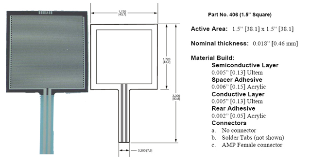

Using a Force Sensing Resistor (FSR) sensor solution:

From [VDrums Forum](https://www.vdrums.com/forum/advanced/diy/61236-easy-to-make-diy-hihat-controller):

<video width="100%" controls>
  <source src="fsr_hh_controller_1.mp4" type="video/mp4">
  Your browser does not support HTML5 video.
</video>

<video width="100%" controls>
  <source src="fsr_hh_controller_2.mp4" type="video/mp4">
  Your browser does not support HTML5 video.
</video>
