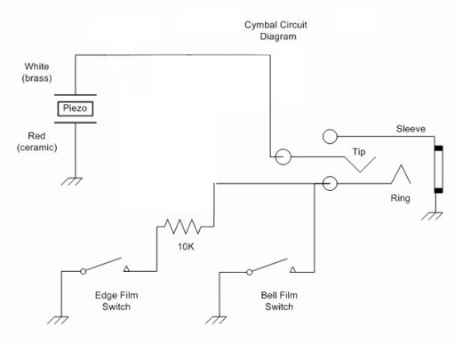
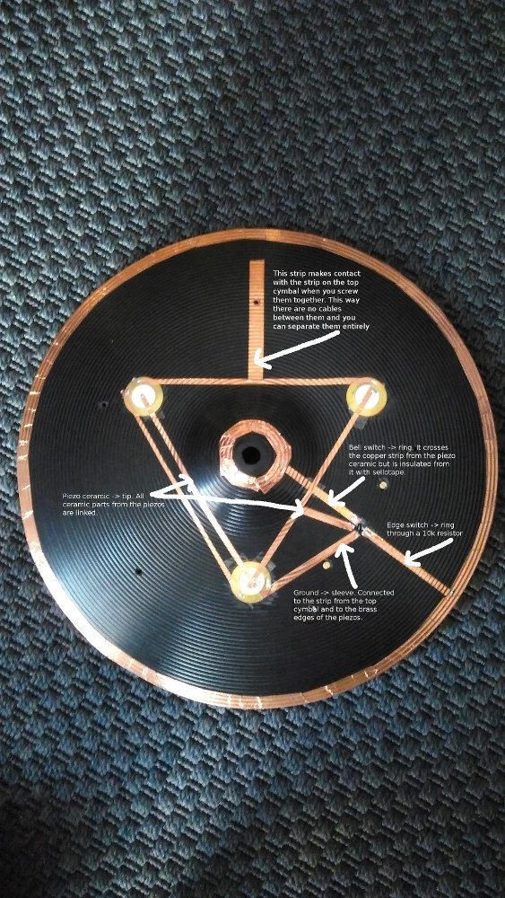
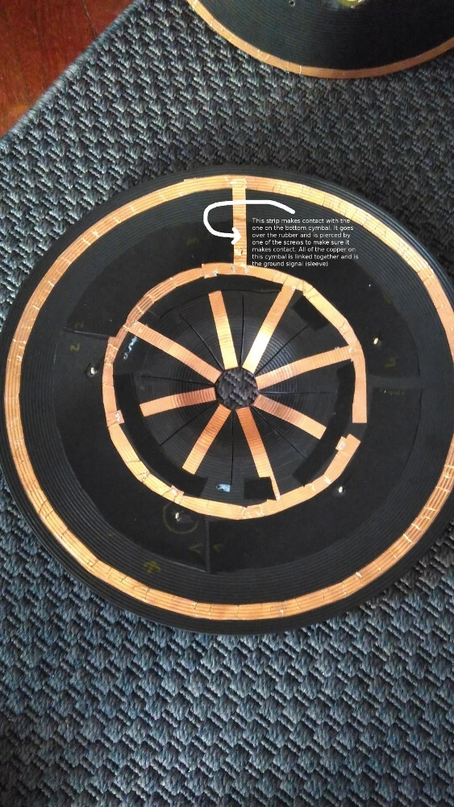

* Modifying an acoustic cymbal or a rubber practice cymbal pad like
  [Peace](http://www.peace-drums.com/products_01.php?u=91&s=143) or
  [Stagg](https://www.staggmusic.com/en/products/cymbals-and-percussion/drums/practice-pads)
* Getting [Myrc Instrument's](https://www.facebook.com/MyrkInstruments)
  membrane trigger switches: [Edge](http://www.ebay.co.uk/itm/Myrk-Membrane-edge-trigger-switches-DIY-dual-zone-choke-E-drum-V-drum-cymbals-/332374396991)
  and [Bell](http://www.ebay.co.uk/itm/Myrk-Membrane-bell-trigger-switches-DIY-dual-3-zone-E-drum-V-drum-cymbals-/332374385518)

**Wiring of a Yamaha 3 zones cymbal**

From [VDrums.com forum](https://www.vdrums.com/forum/advanced/diy/1122419-diy-3-zone-cymbal-v2)

