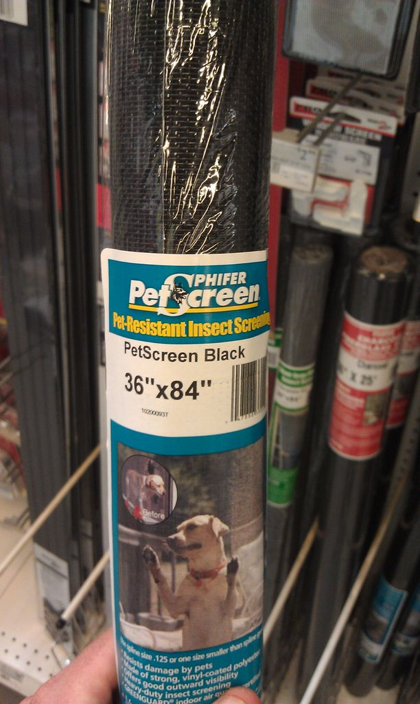
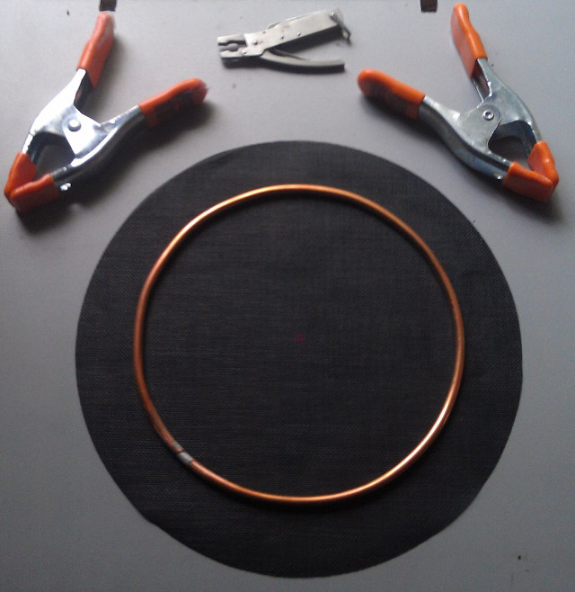
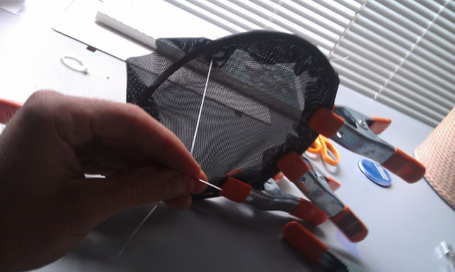

Buy a pet screen or mosquito net:

Prepare using a annealed (soft) copper ring:

Sew the net on the copper ring:

Source: [Instructables website](http://www.instructables.com/id/Homemade-Electronic-Drum-Kit/)
