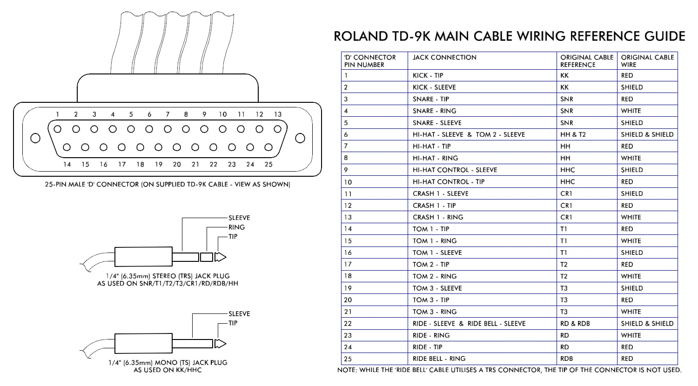
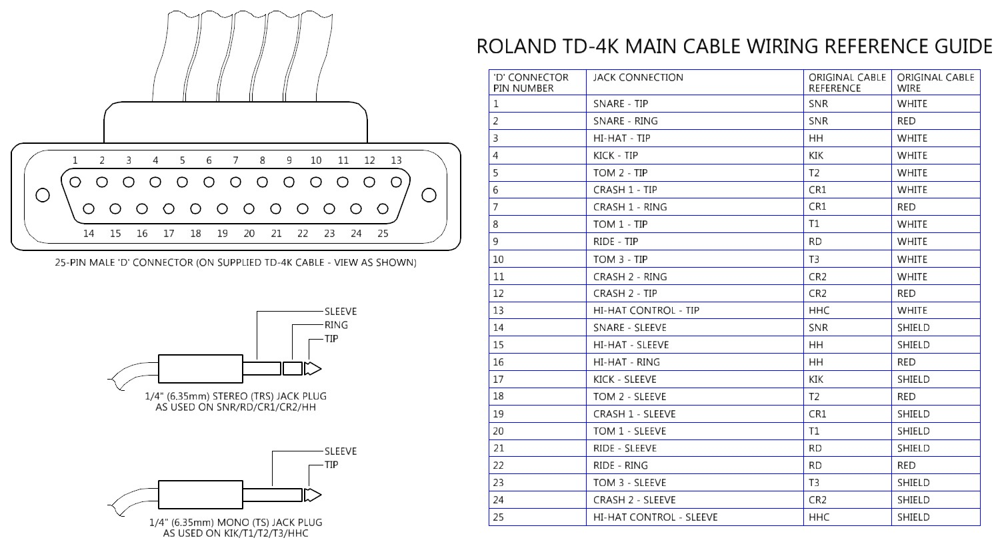
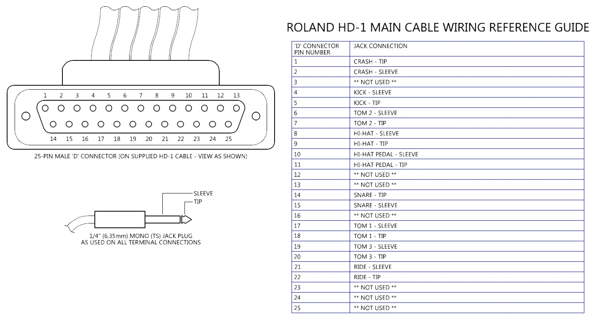
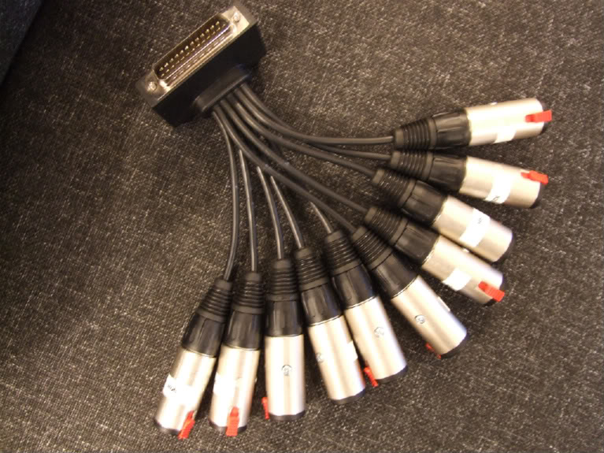

Source: [MisterMR's VDrums.com forum topic](https://www.vdrums.com/forum/advanced/technical/43851-25-pin-d-connector-wiring-guides)

TD-9-11-15-25 ([C5400133R0](http://shop.rolandus.com/p/trigger-cable-harness)):

TD-4 (5100003405):

HD-1 (C5400126R0):

TD-9-11-15-25 Custom:

