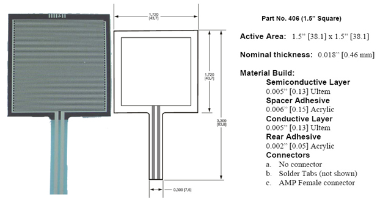

Using a Force Sensing Resistor (FSR) sensor solution:

From [VDrums Forum](https://www.vdrums.com/forum/advanced/diy/61236-easy-to-make-diy-hihat-controller):

<iframe width="480" height="360"
src="http://www.youtube.com/embed/6w2FYu5H6qU">
</iframe>

<iframe width="480" height="360"
src="http://www.youtube.com/embed/z-ROTzYW0A0">
</iframe>
