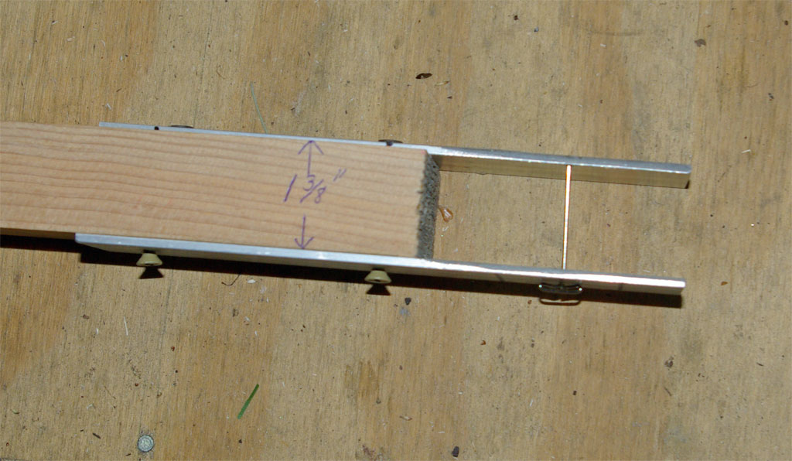
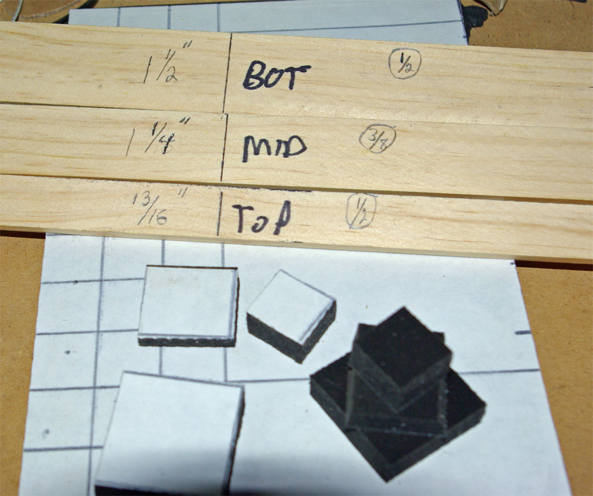
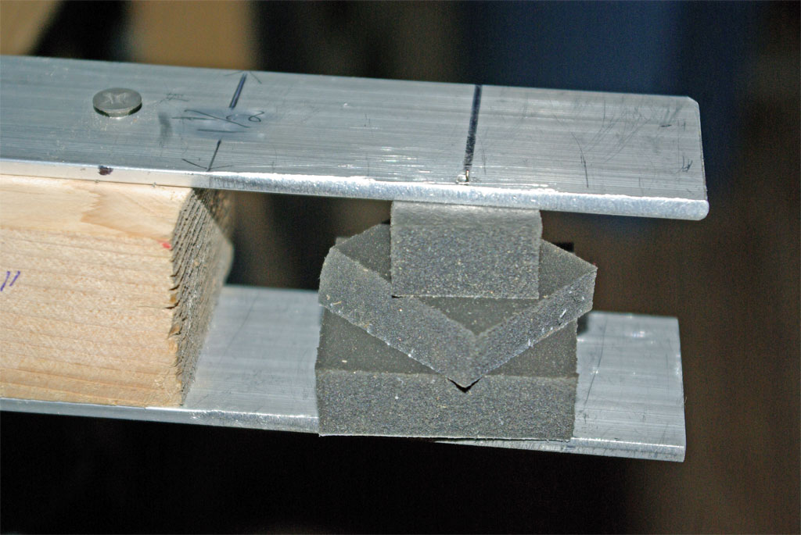
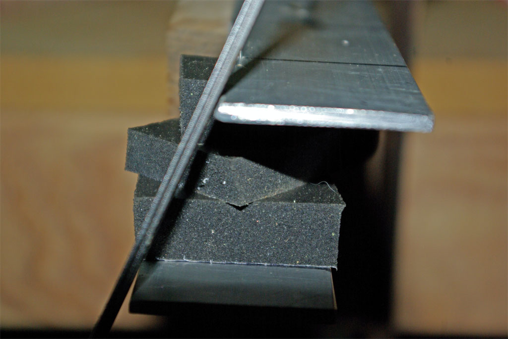
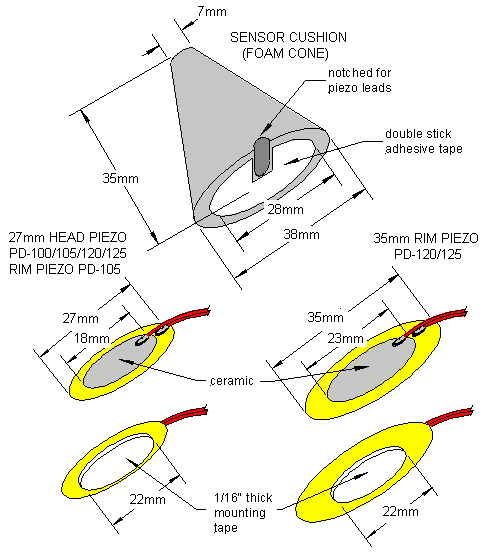

Foto 1: Lo strumento è composto da 2 lamine di alluminio da 38 x 3 mm avvitati
su un pezzo di listello di legno da 57 x 35 mm.
Per bloccare i coni viene utilizzato un perno a 'T' da 45 mm, meglio se da 50.

Foto 2: Per poter inserire il perno le lamine vengono forate utilizzando una
punta di piccolo diametro (1 mm), al centro di quella inferiore (19 mm per lato)
e a 3 mm da un lato di quella superiore.
Le lamine devono essere allineate al pezzo di listello su entrambi i lati.
Le due linee sulla lamina inferiore vengono utilizzate come guide dove posizionare
la base del materiale da tagliare.
Lo strumento verrà fissato sul banco da lavoro.

Foto 3: Qui viene utilizzato un profilo di Supersoft Poron dello spessore di 9,5 mm
(3/8") con superficie adesiva inserito tra altri due da 12,7 mm (1/2").
Le misure di sinistra si riferiscono alla misura massima di ciascun livello,
rispettivamente 38, 31,8 e 20 mm, e quelle di destra dei relativi spessori.
Si potrebbero tagliare di forma circolare ma in questo modo è più semplice anche
se crea più scarto.

Foto 4: I pezzi sono pronti e posizionati.
Il perno viene inserito dalla base verso l'alto, cercando di mantenerlo in linea
con il foro superiore, sporgendo sopra quanto basta per rimanere fermo in
posizione durante il taglio.
Premendo lo strato superiore del materiale per far sporgere la punta del perno
ci si può aiutare per farlo coincidere ed inserire nel foro superiore.

Foto 5: Usando un coltello elettrico (si può usare un seghetto manuale o un
coltello a denti fini) si inizia a tagliare tenendo la lama appoggiata ai bordi
delle lamine di alluminio. A questo punto si ruota delicatamente il cono verso la
lama, facendo attenzione a non comprimerlo per evitare un taglio errato.
Terminato il taglio, si può rifinire il cono con un foglio di carta abrasiva con
grana da 50.
Sulla base del cono si può usare un cutter per creare l'incavo per il passaggio
dei fili, altrimenti si può usare la punta di un saldatore a stagno.
La lamina superiore può essere rifilata rispettando l'angolazione del taglio per
permettere al coltello di appoggiarsi con più precisione, risultando in una
misura precisa anche per la superficie superiore del cono.

Lo strumento nelle foto è stato realizzato per persone mancine, quindi per i
destri potrebbe essere necessaria una diversa costruzione.
