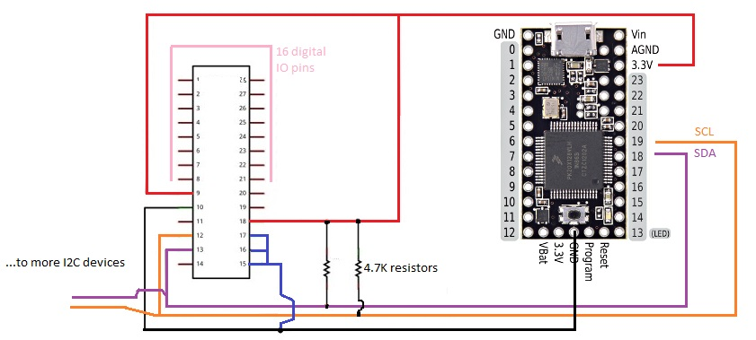

Il Teensy 3.x, a differenza della v.2.x e di Arduino, non tollera i 5V ed è
quindi necessario collegare una resistenza di 'pullup' tra i 3.3V e i
corrispettivi segnali.

Fonti:
* [PJRC](https://www.pjrc.com/teensy/td_libs_Wire.html)
* [Teensy Hauptwerk Projects](https://teensyhauptwerk.wordpress.com/2014/01/17/more-switches-i2c-example/)
