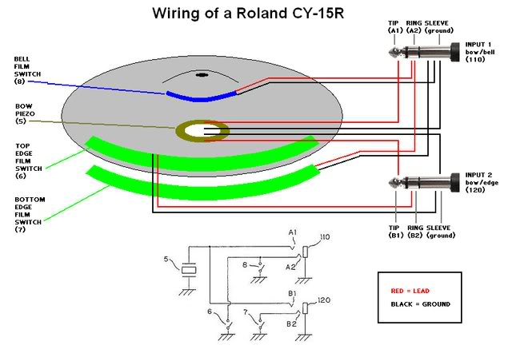

* Using a modified acoustic cymbal or a
[Pintech practice cymbal](http://pintech.com/product/pintech-xt-series-practice-cymbals/)
* Getting [Myrc Instrument's](https://www.facebook.com/MyrkInstruments) membrane trigger switches:
[Edge](http://www.ebay.com/itm/332116496617) and
[Bell](http://www.ebay.com/itm/332140903268)

