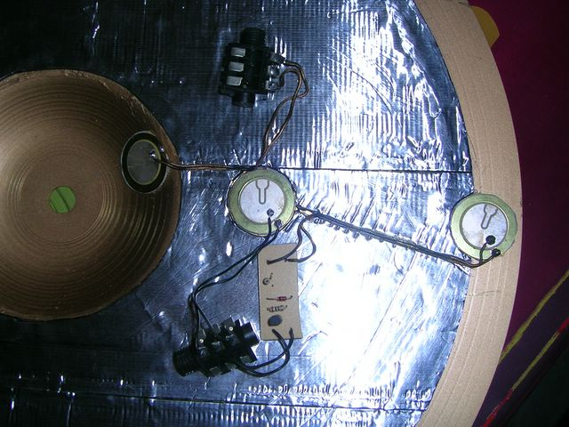
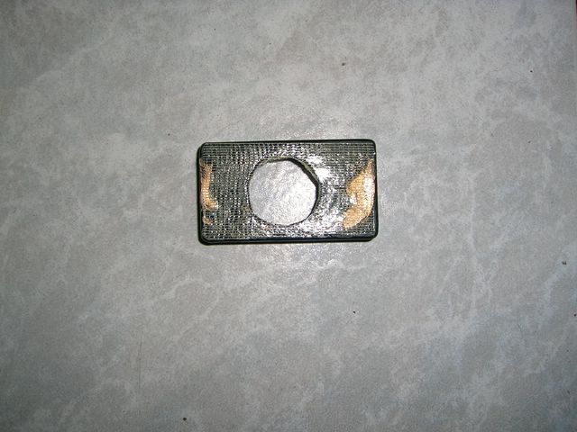
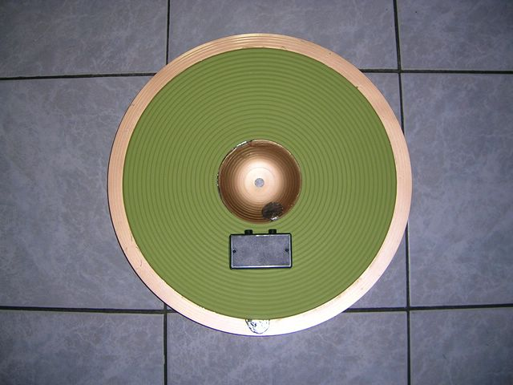

## Material list

- Self adhesive waterproofing bitumen tape (with an aluminium or vinyl foil)
- 1 Ikea PANNÅ place mat (diam. 37cm) made of EVA (various colors available)
- A good length of extra heavy duty double sided reinforced tape (cross woven construction)
- A short length of double-sided foam tape (I do prefere to do it myself using
  some double-sided reinforced tape and a piece of 1mm thick neoprene foam)
- 1 acoustic cymbal
- 1 to 3 or your favorite piezo transducer.
- 1 plastic box
- 1 to 2 jack sockets
- 0 to 2 home made [Piezo/Piezo to Piezo/Switch adapter](./../keith_pp_2_ps) (cf. Keith Raper’s circuit)
- Wire.

## Instructions

### 1 - Dampening the cymbal

**1zone cymbal**: 
Cover the back of the entire cymbal with bitumen tape and cut the unwanted part around the cymbal.
Keep the bell free of bitumen tape.
Cut a small disc from the bitumen tape in order to make a room for the main piezo.

**2zone / 3zone cymbal**: 
Same technique, but you have to let about 3cm from the edge of your cymbal free of bitumen tape.

### 2 - Preparing the covering

Cut a disc in the centre of the place mat, the size of your bell,
and a smaller one for your main piezo. Cut the unwanted part around the cymbal
(if your cymbal is smaller than the covering material)

### 3 - Adding the electronics

A picture is probably better than a long text 😉

2 Zone: 
 

3 Zone: 
 

The main piezo (set on the bow) and the bell piezo must be fixed using double-sided
foam tape (some like to use half a disc instead of a full disc under the piezo).
The edge piezo can be set using the thinner double-sided reinforced tape.
Hide the wires into the bitumen tape (cut a line).

If you want to build a simple 1zone cymbal, just keep the main piezo and forget
the other piezos and the PP to PS adapter circuit.

### 4 – Covering the all thing

Put some double-sided reinforced tape on your bitumen tape, but don’t remove the protection yet!
Put a lot of it around the main piezo room (it will help the plastic box to stay in place later).
Make all the electronic stuff pass thru the small hole and check for bumps on the surface to cover.

Keep the covering stuff correctly placed on your cymbal and remove the tape protection little by little.

 

### 5 – Finishing

Prepare the needed holes in the plastic box for the main piezo and jack sockets.
Check them twice 😉
Use a piece of double-sided reinforced tape to fix the plastic box on the
covering material (when I say extra heavy duty double-sided reinforced tape in
the material list, I mean really heavy duty ^^).
Secure the jack sockets and put the box cover.

 
 

Put a small disc of bitumen tape over the visible piezo transducers
(it will help to secure the solder points, and be a cool thing to “choke”).

2Zone 
 

3Zone 

### 6 – Setting up your module

**1Zone**:

Plug your trigger then set the sensitivity and main parameters.

**2Zone**:

Use a dual Piezo/Switch capable input.
Set the trigger type as you would do for a Piezo/Switch cymbal (CY-8 / PCY-65S, for exemple)
Set the sensitivity and main parameters.
If the the edge triggering is too sensitive, add a pot between the edge piezo
and the PP to PS adapter, and adjust it.

**3Zone**:

Use a dual Piezo/Switch input + a mono input (or a dual one)
Plug the bow/edge output of the cymbal to the dual input.
Plug the bell output to the mono input of your module.
Set parameters for the bow/edge part as you would do with a 2Zone cymbal.
If the the edge triggering is too sensitive, add a pot between the edge piezo
and the PP to PS adapter, and adjust it.
Set parameters for the bell part as you would do with a 1Zone cymbal, then set
its threshold so your harder tip hits on the bow don’t trigger the bell.

### 7 – Choke switch

The edge piezo combined to the PP to PS adapter will act as a choke switch.
Cherry on the cake 🙂

### 8 – Some ideas to experiment with...

* If you own a Roland 3Zone ride input, you may add a additional PP to PS adapter
  between the bell piezo and the Bell jack socket (sleeve/ring).
  Don’t forget to link the main piezo to the tip/sleeve couple of this same socket.
  You’ll get the needed Bow/Edge and Bow/Bell output this way.

  **NOTE: Polarity is inverted on Roland main piezo**

[//]: #  Or a simple alternative:
[//]: #

* If you want to use a Yamaha 3Zone input, you may use 1 single jack socket.
  Firstly mount the 2Zone electronic part then add a PP to PS adapter AND a 10k
  resistor between the bell piezo (+) and the ring of the single jack socket.

* You may build such a cymbal from a practice cymbal and use another place mat
  as your playing surface.

The original post is available on the
[Toontrack website](https://www.toontrack.com/forum/e-drum-workshop/design-2z3z-choke-capable-cymbal-by-pfozz/#p46574).

There is an article on this topic in the
[april issue of DigitalDrummer magazine](https://edrums.sourceforge.io/diy/cymbal_piezo/april+2010+final+lowres.pdf#page=43).

