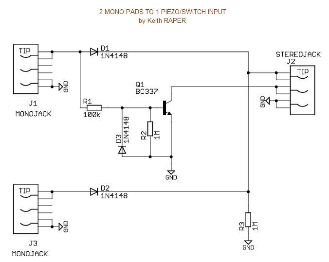
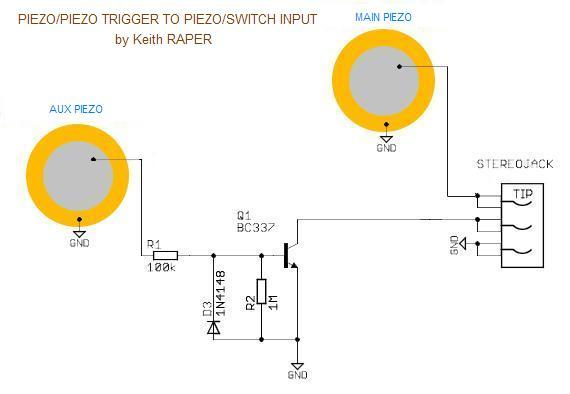
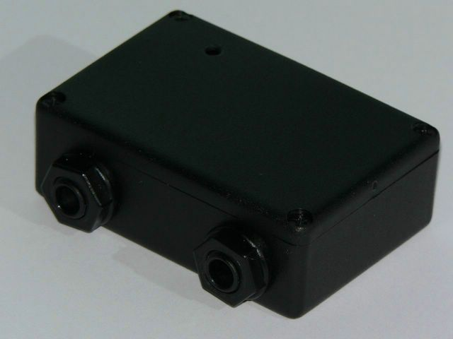
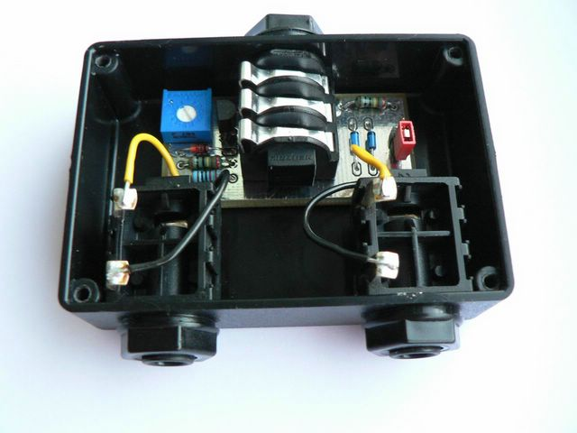

**DON'T MISS THE UPDATED INFO BELOW THE ORIGINAL CONTENT** 😉

The information provided here is freely available to all for NON-COMMERCIAL purposes only.

The schematics and information are provided 'as is', without warranty of any kind.

As everything provided on this website, the author (Keith Raper), EDrum For Free
or any other party cannot be held responsible for any damages to yourself,
others, or equipment while attempting any of the projects listed on these pages.

Please use common sense.

---
Many of you and mostly members of the
[DTXPress Yahoo! group](https://groups.yahoo.com/neo/groups/DTXpress/info)
have heard about the "Magic Box" which will allow two pads to use one input on
the DTXpress, and also combine two piezos from a single pad into a single piezo
and rim switch signal for use on the DTXpress (some non Yamaha dual zone pads
use two piezos instead of a single piezo and a rim switch).

As the original "Magic Box" was quite complex, I have come up with a simplified
idea which should be within the abilities of anyone who wants to have a go.
The components will only cost a few cents and the circuit is "passive" in that
it does not use any external power (but has an "active" component).

Here are some schematics for various applications:

NB : Bear in mind that when combining two pads into one input you can only get one
sound at a time (although you can get both if one hit is slightly after the other)
so you need to choose your combinations with some thought
(ie don't combine the kick drum, snare or high-hat with anything).

<!--img src="./Visual-Representation-of-Circuit.jpg" alt="Visual-Representation-of-Circuit.jpg" class="img-responsive"-->

Example applications :

- Mesh Head dual-trigger (piezo/piezo) to piezo/switch input
  (Dual mesh toms on the TD-8/TD-6V/DTXPress/...).

- [Dual-zone cymbal](./../cymbal_piezo) made of 2 piezos (design by PFozz to come).

- [Triple-zone cymbal](./../cymbal_piezo) made of 3 piezos (design by PFozz to come).

- ...

For less "rim/edge sensitivity", reduce the R2 value but DON'T replace it with
a wire (100K to 1M is alright). 

---
## UPDATED (03/2006)
I have now made a PCB and am building up my [DTXpander](http://dtxpander.co.uk/) (for a small fee)
for people who cannot do it themselves.

 
 

I am still happy for people to build their own, and here's the latest circuit:
[http://edrum.for.free.fr/static/pictures/KeithRDTXpanderCheapB.pdf](./KeithRDTXpanderCheapB.pdf)

The changes are minor :

1. putting a potentiometer for R1 to adjust sensitivity
2. Schottky diodes to reduce the voltage drop from the piezos (0.3V instead of 0.7V)
3. a jumper to allow one of the diodes to be shorted out.

These changes may help with systems not like my commercial DTXpress kit.

The Schottky diodes will help if the piezo signals are low.
I have not noticed any difference with the DTXpress.
The option to bypass one of the diodes can help improve the signal from that pad
if the polarity is wrong on the pad - the circuit works best with positive going
pulses from the piezo.

Enjoy 😉

Keith Raper

(Key Design Electronics Ltd.)

<http://www.kdel.co.uk>

There is an article on this topic in the
[october issue of DigitalDrummer magazine](./digitalDrummer_October_final.pdf#page=50).
