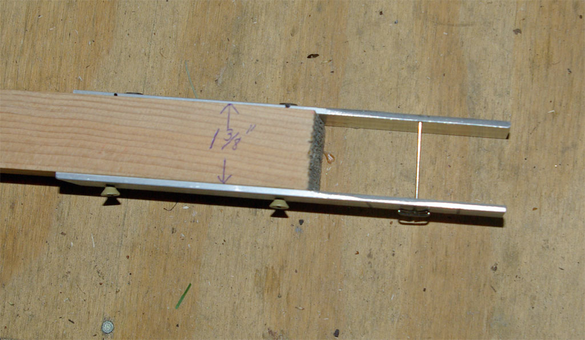
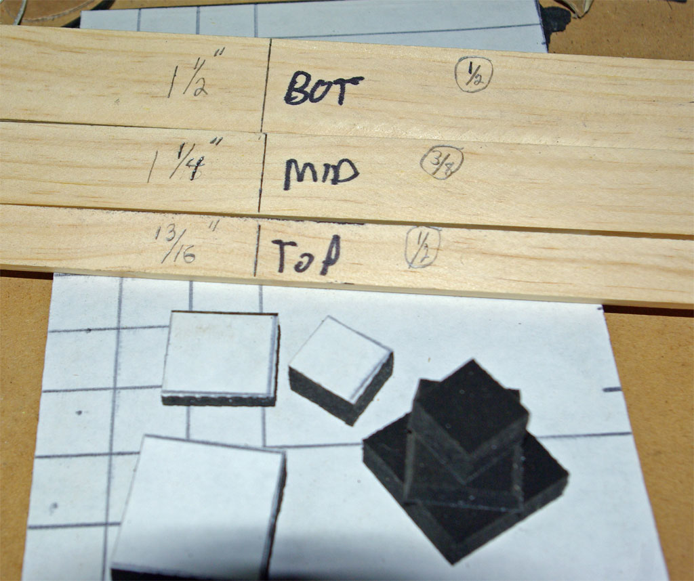
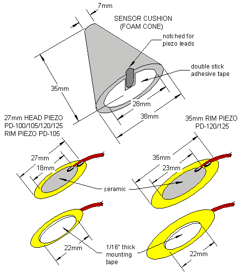

Pic #1: Shows the complete jig with axis pin in place. Two 1 1/2" x 1/8" pieces
of aluminum screwed to a 2 1/4" wide x 1 3/8" thick piece of wood. I use a table
saw to rip a 2x4 down to 1 3/8" but you could stack various thicknesses to equal
1 3/8". You can make the thickness equal to whatever your foam is. I also made
one for Roto-toms that is only 1" thick...all other measurements remain the same.
I am using a 1 3/4" "T" pin...a 2" pin would work better I think.

Pic #2: Using the smallest bit I have I drilled a hole in the bottom piece in
the center (3/4" from each side) and a hole in the top piece 1/8" from one side
trying to keep the same measurement from each end. I secure the bottom piece of
aluminum first then using a square block of the 1 3/8" wood as a guide I secure
the top piece. It is important that the holes are lined up square and plumb with
each other. The edges of the aluminum should be flush with the wood on either side.
The two lines on the bottom piece are used to line-up the foam blank and keep
the center over the hole. Clamp the jig to your work bench.

Pic #3: I use one square of 3/8" Supersoft Poron foam (adhesive backed) sandwiched
between two squares of 1/2" foam. I calculated each layer's maximum dimension and
made strips to mark the back of the Poron sheets in squares that I cut with my
electric carving/filet knife. The left measurements are the proper dimension for
each layer...the right denotes each layer's thickness. I then stack the layers
ala Jman's Castles using the adhesive but do not remove the bottom layer's paper
(use that adhesive to adhere to your piezo). Alternating the layers will help to
center them. I used to cut circles but found this easier although a little more
wasteful.

Pic #4: The blank is ready for the knife. Using the marks center the blank and
push the pin in from the bottom as square as you can...this is tricky but if you
miss the top hole just pull the pin away from the top piece slightly and poke it
just above the foam's surface and slide it back into position. A small block of
wood glued to the underside next to the hole might aid this step. If I find a
longer pin I plan to glue a guide block with a small hole there. The top of the
pin should only protrude slighly above the top or the knife will hit it.
The closer to the axis you get the better your cones will look. If you are off
the cone will be somewhat angled...not a big deal really IMO.

Pic #5: Using an electric knife (you can use fine tooth manual saw or knife) I
start to cut holding the blade against the jig...once the blade gets to the axis
gently turn the cone by hand towards the blade. Be carefull not to distort the
cone as you turn. I cut in small passes until I get the shape right spinning the
cone and trimming. With the cone still in the jig, I then use 50 grit sandpaper
and buff the sides but that sep is not critical. I use an exacto knife to cut the
slot in the bottom of the cone for the wires but I have heard of people using a
hot soldering iron. I also filed the top piece of aluminum at an angle to allow
the knife better contact with the foam...if you don't the cone will be slightly
larger than 1/4" at the top...no bigggie IMO.

It's important to know that I am a "lefty" and this jig is designed for "lefties"
only. If you "righties" can't figure it out then too bad. 

