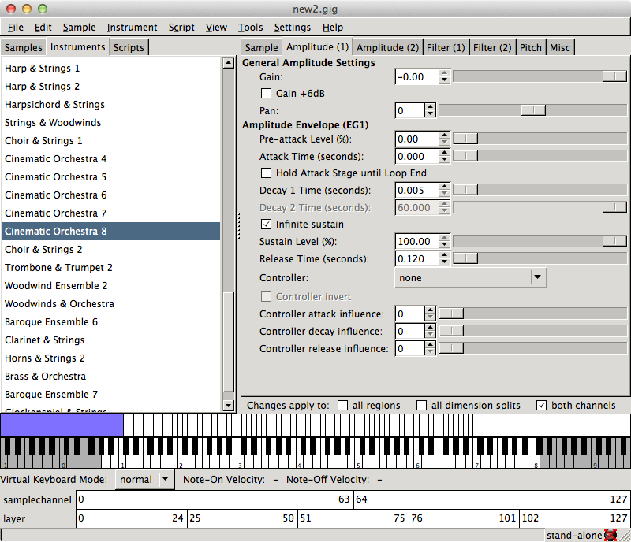

Gigedit is a graphical instrument editor for sample based virtual instruments,
based on the GigaStudio/Gigasampler file format. The GigaStudio/Gigasampler (.gig)
file format is one of the major sampler formats supported by LinuxSampler and
hence you can use Gigedit both as stand-alone instrument editor, or in conjunction
with LinuxSampler for editing such instruments "live" while playing them with the
sampler.

> This documentation is currently in a transition phase. The old Gigedit manual
will move to this location, however this process has not been completed yet. You
may want to refer to the [old Gigedit manual](http://www.linuxsampler.org/documentation.html)
in the meantime.

So far, the only topic covered by this new manual is [managing real-time instrument scripts](scripts)
with Gigedit.

 
<link rel="stylesheet" href="/linuxsampler/style.css">

    

    

<a href="..">↑ LinuxSampler Documents</a>

    

<a href="scripts">→ Managing Scripts</a>

