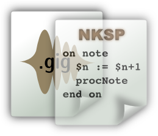

This document intends to give you a compact introduction and overview to the NKSP
real-time instrument script language, so you can start writing your own instrument
scripts in short time. It concentrates on describing the script language. If you
rather want to learn how to modify and attach scripts to your sounds, then please
refer to the gigedit manual for [how to manage instrument scripts with gigedit](../gigedit/scripts)
for Gigasampler/GigaStudio format sounds, or refer to the SFZ opcode [script](../sfz/opcode/script)
for attaching NKSP scripts with SFZ format sounds.

### At a Glance

NKSP stands for "is **N**ot **KSP**", which denotes its distinction to an
existing proprietary language called KSP. NSKP is a script language specifically
designed to write real-time capable software extensions to LinuxSampler's sampler
engines that can be bundled individually with sounds by sound designers themselves.
Instead of defining a completely new script language, NKSP is leaned on that
mentioned properiatary script language. The biggest advantage is that sound
designers and musicians can leverage the huge amount of existing KSP scripts
which are already available for various purposes on the Internet, instead of
being forced to write all scripts from scratch in a completely different language.

That also means however that there are some differences between those two
languages. Some extensions have been added to the NKSP core language to make it
a bit more convenient and less error prone to write scripts, and various new
functions had to be added due to the large difference of the sampler engines and
their underlying sampler format. Efforts have been made though to make NKSP as
much compatible to KSP as possible. The NKSP documentation will emphasize
individual differences in the two languages and function implementations wherever
they may occur, to give you immediate hints where you need to take care of
regarding compatibility issues when writing scripts that should be spawned on
both platforms.

Please note that the current focus of NKSP is the sound controlling aspect of
sounds. At this point there is no support for the graphical user interface
function set of KSP in NKSP. 

## Event Handlers

NKSP is an event-driven language. That means you are writing so called event
handlers which define what the sampler shall do on individual events that occur,
while using the sound the script was bundled with. An event handler in general
looks like this:

**on** `event-name` 
  `statements` 
**end on**

There are currently four events available:

| Event Type          | Description
| ------------------- | -----------
| **on** `note`       | This event handler is executed when a new note was triggered, i.e. when hitting a key on a MIDI keyboard.
| **on** `release`    | This event handler is executed when a new note was released, i.e. when releasing a key on a MIDI keyboard.
| **on** `controller` | This event handler is executed when a MIDI control change event occurred. For instance when turning the modulation wheel at a MIDI keyboard.
| **on** `init`       | Executed only once, as very first event handler, right after the script had been loaded. This code block is usually used to initialize variables in your script with some initial, useful data.

You are free to decide for which ones of those event types you are going to write
an event handler for. You can write an event handler for only one event type or
write event handlers for all of those event types. Also dependent on the
respective event type, there are certain things you can do and things which you
can't do. But more on that later.

### Note Events

As a first example, the following tiny script will print a message to your
terminal whenever you trigger a new note with your MIDI keyboard. 

**on** `note` 
&nbsp;&nbsp;[message](message)(`"A new note was triggered!"`) 
**end on**

Probably you are also interested to see which note you triggered exactly. The
sampler provides you a so called built-in variable called `$EVENT_NOTE` which
reflects the note number (as value between 0 and 127) of the note that has just
been triggered. Additionally the built-in variable `$EVENT_VELOCITY` provides
you the velocity value (also between 0 and 127) of the note event.

**on** `note` 
&nbsp;&nbsp;[message](message)(`"Note "` & `$EVENT_NOTE` & `" was triggered with velocity "` & `$EVENT_VELOCITY`) 
**end on**

The & character concatenates text strings with each other. In this case it is
also automatically converting the note number into a text string.

<note class="important">
The message() function is not appropriate for being used with your final
production sounds, since it can lead to audio dropouts. You should only use the
message() function to try out things, and to spot and debug problems with your
scripts.
</note>

### Release Events

As counter part to the `note` event handler, there is also the `release` event
handler, which is executed when a note was released. This event handler can be
used similarly:

**on** `release` 
&nbsp;&nbsp;[message](message)(`"Note "` & `$EVENT_NOTE` & `" was triggered with velocity "` & `$EVENT_VELOCITY`) 
**end on**

Please note that you can hardly find MIDI keyboards which support release
velocity. So with most keyboards this value will be 127.

### Controller Events

Now let's extend the first script to not only show note-on and note-off events,
but also to show a message whenever you use a MIDI controller (i.e. modulation
wheel, sustain pedal, etc.).

**on** `note` 
&nbsp;&nbsp;[message](message)(`"Note "` & `$EVENT_NOTE` & `" was triggered with velocity "` & `$EVENT_VELOCITY`) 
**end on**

**on** `release` 
&nbsp;&nbsp;[message](message)(`"Note "` & `$EVENT_NOTE` & `" was triggered with velocity "` & `$EVENT_VELOCITY`) 
**end on**

**on** `controller` 
&nbsp;&nbsp;[message](message)(`"MIDI Controller "` & `$CC_NUM` & `" changed its value to "` & `$CC[$CC_NUM]`) 
**end on**

It looks very similar to the note event handlers. `$CC_NUM` reflects the MIDI
controller number of the MIDI controller that had been changed and `%CC` is a so
called array variable, which not only contains a single number value, but instead
it contains several values at the same time. The built-in `%CC` array variable
contains the current controller values of all 127 MIDI controllers. So `%CC[1]`
for example would give you the current controller value of the modulation wheel,
and therefore `%CC[$CC_NUM]` reflects the new controller value of the controller
that just had been changed.

There is some special aspect you need to be aware about: in contrast to the MIDI
standard, monophonic aftertouch (a.k.a. channel pressure) and pitch beend wheel
are handled by NKSP as if they were regular MIDI controllers. So a value change
of one of those two triggers a regular `controller` event handler to be executed.
To obtain the current aftertouch value you can use `%CC[$VCC_MONO_AT]`, and to
get the current pitch bend wheel value use `%CC[$VCC_PITCH_BEND]`.

### Script Load Event

As the last one of the four event types available with NKSP, the following is an
example of an `init` event handler.

**on** `init` 
&nbsp;&nbsp;[message](message)(`"This script has been loaded and is ready now!"`) 
**end on**

You might think, that this is probably a very exotic event. Because in fact,
this "event" is only executed once for your script: exactly when the script was
loaded by the sampler. This is not an unimportant event handler though. Because
it is used to prepare your script for various purposes. We will get more about
that later.

## Comments

Let's face it: software code is sometimes hard to read, especially when you are
not a professional software developer who deals with such kinds of things every
day. To make it more easy for you to understand, what you had in mind when you
wrote a certain script three years ago, and also if some other developer might
need to continue working on your scripts one day, you should place as many
comments into your scripts as possible. A comment in NKSP is everything that is
nested into a an opening and closing pair of curly braces.

`{ This is a comment. }`

You cannot only use this to leave some human readable explanations here and
there, you might also use such curly braces to quickly disable parts of your
scripts for a moment, i.e. when debugging certain things.

**on** `init` 
&nbsp;&nbsp;{ The following will be prompted to the terminal when the sampler loaded this script. } 
&nbsp;&nbsp;[message](message)(`"My script loaded."`)  
&nbsp;&nbsp;{ This code block is commented out, so these two messages will not be displayed } 
&nbsp;&nbsp;{ 
&nbsp;&nbsp;&nbsp;&nbsp;message("Another text") 
&nbsp;&nbsp;&nbsp;&nbsp;message("And another one") 
&nbsp;&nbsp;} 
**end on**

## What Next?

You have completed the introduction of the NKSP real-time instrument script
language at this point. You can now dive into the details of the NKSP language
by moving on to the [NKSP reference documentation](reference) which
provides you an overview and quick access to the details of all built-in
functions, built-in variables and more.

 
<link rel="stylesheet" href="/linuxsampler/style.css">

    

    

<a href=".">↑ Instrument Scripts</a>

    

<a href="reference">→ NKSP Reference</a>

