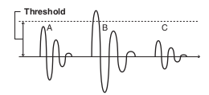
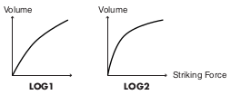
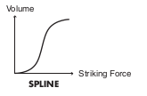
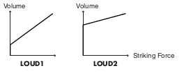
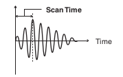
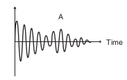
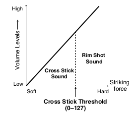

## BASIC

### Pad Sensitivity (1 - 32)

You can adjust the sensitivity of the pads to accommodate your personal playing
style.
This allows you to have more dynamic control over the sound volume, based on how
hard you play.
Higher sensitivity allows the pad to produce a loud volume even when played softly.
Lower sensitivity will keep the pad producing a low volume even when played forcefully.

### Threshold (Minimum level for the pad, 0 - 31)

This setting allows a trigger signal to be received only when the pad is above a
determined force level (velocity). This can be used to prevent a pad from
sounding because of vibrations from other pads.
In the following example, B will sound but A and C will not sound.

When set to a higher value, no sound is produced when the pad is struck lightly.
Gradually raise the “Threshold” value while striking the pad.
Check this and adjust accordingly. Repeat this process until you get the perfect
setting for your playing style.

### Velocity Curve (How Playing Dynamics Changes the Volume)

This setting allows you to control the relation between playing velocity
(striking force) and changes in volume. Adjust this curve until the response
feels as natural as possible.

**LINEAR**

The standard setting. This produces the most natural correspondence between
playing dynamics and volume change.

**EXP1, EXP2**

Compared to LINEAR, strong dynamics produce a greater change.

**LOG1, LOG2**

Compared to LINEAR, a soft playing produces a greater change.

**SPLINE**

Extreme changes are made in response to playing dynamics.

**LOUD1, LOUD2**

Very little dynamic response, making it easy to maintain strong volume levels.
If using drum triggers, these settings help maintain stable levels.

## XTALK (Eliminate Crosstalk Between Pads)

When two pads are mounted on the same stand, hitting one pad may trigger the
sound from another pad unintentionally. (This is called **crosstalk**). Eliminate
this by adjusting Xtalk Cancel on the pad that is sounding inadvertently.

*In some cases, you can prevent crosstalk between two pads by increasing the
distance between them.*

**Crosstalk Example: If you hit the snare pad and the tom 1 also sounds**

Set the snare and tom 1 to the same XTALK GROUP.
Raise the “XTALK CANCEL” for the pad being used for the tom 1. The tom 1 pad will
be less prone to receive crosstalk from other pads. With a setting “OFF,”
crosstalk prevention will not work.

> If the value is set too high, and two pads are played simultaneously, the one
that is struck less forcefully may not sound. Be careful and set this parameter
to the minimum value required to prevent crosstalk.

## ADVANCE (Advanced Trigger Parameters)

### Scan Time (Trigger Signal Detection Time, 0 - 4.0 ms)

**Specifies the detection time for the trigger signal.** 
Since the rise time of the trigger signal waveform may differ slightly depending
on the characteristics of each pad or acoustic drum trigger (drum pickup), you
may notice that identical hits (velocity) may produce sound at different volumes.
If this occurs, you can adjust the “Scan Time” so that your way of playing can be
detected more precisely.

While repeatedly hitting the pad at a constant force, gradually raise the
Scan Time value from 0 msec, until the resulting volume stabilizes at the loudest
level. At this setting, try both soft and loud strikes, and make sure that the
volume changes appropriately.

> As the value is set higher, the time it takes for the sound to be played
increases. Set this to the lowest value possible.

### Retrigger Cancel (Detecting Trigger Signal Attenuation, 1 - 16)

**This setting prevents spurious re-triggering.** 
Important if you are using acoustic drum triggers. Such triggers can produce
altered waveforms, which may also cause inadvertent sounding at Point A in the
following figure (**Retrigger**).

This occurs in particular at the decaying edge of the
waveform. Retrigger Cancel detects such distortion in and
prevents retriggering from occurring. 
While repeatedly striking the pad, raise the “Retrig Cancel”
value until retriggering no longer occurs.

> Although setting this to a high value prevents retriggering, it then becomes
easy for sounds to be omitted when the drums played fast (roll etc.). Set this to
the lowest value possible while still ensuring that there is no retriggering.

*You can also eliminate this problem of retriggering with the Mask Time setting.
Mask Time does not detect trigger signals if they occur within the specified
amount of time after the previous trigger signal was received. Retrigger Cancel
detects the attenuation of the trigger signal level, and triggers the sound
after internally determining which trigger signals were actually generated when
the head was struck, while weeding out the other false trigger signals that need
not trigger a sound.*

### Mask Time (Double Triggering Prevention, 0 - 64 ms)

**This setting prevents double triggering.**
When playing a kick trigger the beater can bounce back and hit the head a second
time immediately after the intended note—with acoustic drums sometimes the beater
stays against the head—this causes a single hit to “double trigger” (two sounds
instead of one). The Mask Time setting helps to prevent this. Once a pad has been
hit, any additional trigger signals occurring within the specified “Mask Time”
(0–64msec) will be ignored.

Adjust the “Mask Time” value while playing the pad.
When using a kick trigger, try to let the beater bounce back and hit the head
very quickly, then raise the “Mask Time” value until there are no more sounds
made by the beater rebound.

> When set to a high value, it will be difficult to play very quickly. Set this
to as low a value as you can.

*If two or more sounds are being produced when you strike the head just once,
then adjust Retrig Cancel.*

### Rim Gain (Rim/Edge Dynamic Response, 0 – 3.2)

When a PD-125/120/105/85/80R, PD-9/8/7, CY series pad, VH-12/11, or RT-5S (trigger)
is connected, you can adjust the relation between your playing velocity (force)
on the rim/edge and the resulting volume level.
Higher value allows the rim/edge to produce a loud volume even when played softly.
Lower value will keep the rim/edge producing a low volume even when played forcefully.

### Rim Shot Adjust (Rim Shots Response, 0 – 8.0)

When a PD-125/120/105/85/80R or RT-5S (trigger) is connected, you can adjust the
sensitivity of the rim response.
There are some cases that you have a rim sound unexpectedly when you hit the head
strongly. You can improve this situation with decreasing the value of
“RimShot Adjust.”

> When you set the value too small, it might be difficult to play the rim sound.

### XStick Thrshld (Cross Stick Threshold, 0 – 127)

When a PD-125/120/105/85/80R or RT-5S (trigger) is connected, you can determine
the “cross over point” between the cross stick and a rim shot sounds.

Setting this to a higher value makes it easier to get cross stick sounds. When
set to “0,” playing a cross stick produces the open rim shot sound.

> Increasing the value excessively may cause the cross stick to sound as well
when the open rim shot is played.

