[Versione in PDF](montaggio.pdf)

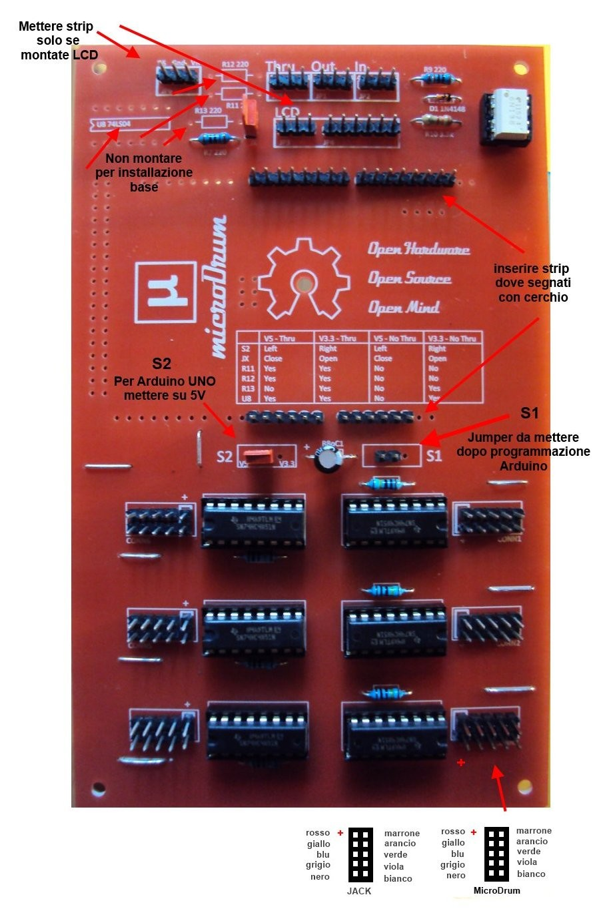

1. Montare le 6 resistenze 1M Omh a fianco zoccoli integrati (SN74HC4851) come segnato
su C.S, tirare i ponti (con i terminali resistenze avanzati o con dei fili), dove segnato su C.S,
montare diodo 1n4148m, resistenze 220, resistenza 330, zoccolo per 6N138 (tutti collocati in
alto a destra C.S vista da sopra serigrafie diritte).

2. Montate gli strip MIDI e montare gli strip lcd e strip alimentazione LCD solo se intendete
usare un LCD.
In alto a sinistra (guardando da sopra C.S), c'è una predisposizione per componenti, non
servono per l'assemblaggio di base (vedi note su disegno), in quella zona l'unica resistenza da
montare è R7, 220 Omh.

3. Montare strip per Jumper S2 e S1 (se usate Arduino UNO volendo S2 può essere solo un
ponte tra 5V e centrale, per S1 montare strip a sinistra, (sempre guardando da sopra C.S).
Non inserite per il momento il Jumper S1, ci serve aperto per programmare Arduino, una
volta chiuso, Arduino non sarà più programmabile se non rimuovendolo; con S1 inserito
Arduino non si resetterà ad ogni riavvio.

4. Montare gli zoccoli per integrati SN74HC4851, stare attenti alla polarità come segnato su
C.S, montare tutti gli strip per i cavi JACK (con1-con6), montare strip per connessione
Arduino come indicato su C.S, gli strip vanno inseriti solo dove segnato con pallini bianchi
su C.S. Montare elettrolitico 10 micro rispettando polarità, (in alcuni casi è prevista una
resistenza da 120 Omh).

5. Controllate tutto, inserire tutti gli integrati rispettando polarità, collegare le schede Jack su
con1-con6 mediante il multicavo colorato, seguite lo schema riportato (al momento la scheda
Jack è sprovvista di alcune serigrafie, guardare la guida montaggio JACK per maggiori
dettagli su polarità, disposizione componenti e sequenza colori cavi).

6. Collegate il cavo USB il quale alimenterà la Microdrum, ora potete procedere alla
programmazione del firmware su Arduino come spiegato nella guida di programmazione
Firmware Microdrum. Attenzione al fissaggio delle torrette di sostegno del C.S, mettete delle
rondelle isolanti in quanto alcune piste sono vicine e possono causare corti che causano falsi
segnali sui sensori piezo.

## Cablaggio Scheda Jack

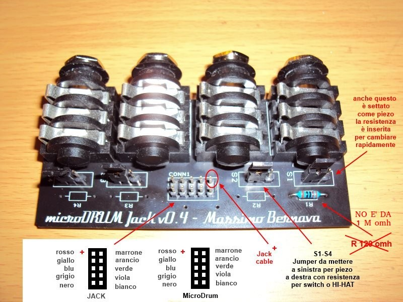

1. Saldare i JACK sul C.S come segnato, saldare gli strip S1-S4 e gli
strip su CONN1 come da figura.

2. Saldare la resistenza R1 (**può essere 15K - 1M leggere sezione
HiHat Variabile**), la quale predispone la singola presa JACK per
configurazioni SWITCH o HH regolabile.

3. Inserire i Jumper su S1-S4 a SINISTRA guardando da sopra il C.S
come da disegno, in questa posizione i jack sono predisposti per ricevere
segnali PIEZO. Se si spostano i jumper dove presente la resistenza (in
questo disegno solo su R1) a DESTRA, viene abilitata la gestione
SWITCH o HH regolabile.

4. Collegare il multicavo colorato su CONN1 rispettando la sequenza
colori riportata, il polo positivo sulla scheda JACK, si trova in alto a
destra verso l'interno del C.S come segnato su disegno.

5. Collegare lato opposto il cavo multicolore alla Microdrum nei
rispettivi connettori CONN(x) rispettando la sequenza colori, aiutarsi
con lo schema riportato.

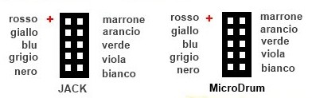
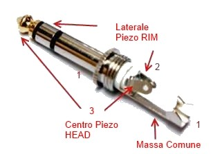
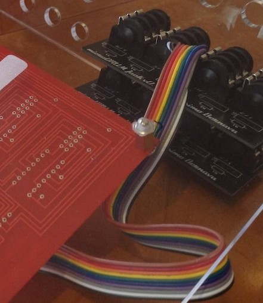

## Hi-Hat Soluzione Pulsante On/Off

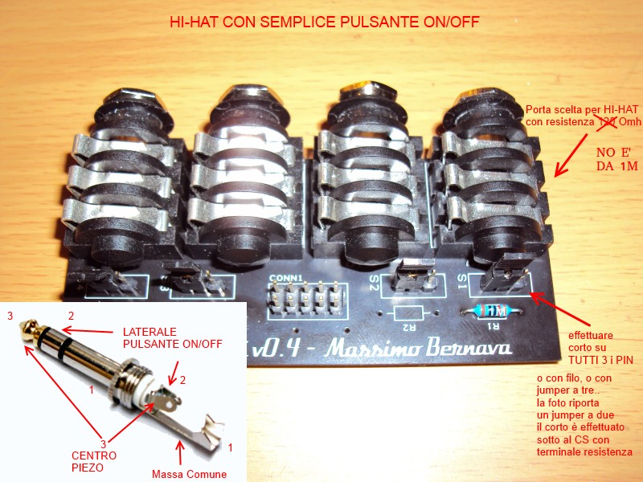

Effettuando il corto sui tre PIN sulla scheda JACK (S1 in questo caso, vedi dettagli nota a
fianco), dei due ingressi, uno perde la funzione PIEZO(sensore trigger), quel PIN è
quello a cui dobbiamo collegare il pulsante (soluzione ON/OFF), in linea generale è tra
massa(1) e laterale (2) l'altro ingresso(3) gestirà il sensore piezo del piatto HH; un unica
presa JACK intero HI-HAT. Può essere necessario invertire la configurazione dei PIN a
livello software (DrumMap vedere sezione dedicata), per ottenere l'esatta assegnazione
degli ingressi (può infatti verificarsi che il pulsante ON/OFF generi NOTA MIDI anziché
segnale CC), si può controllare in monitor l'esatta assegnazione dei PIN, non è possibile
agire sui cavi per invertire questa configurazione.

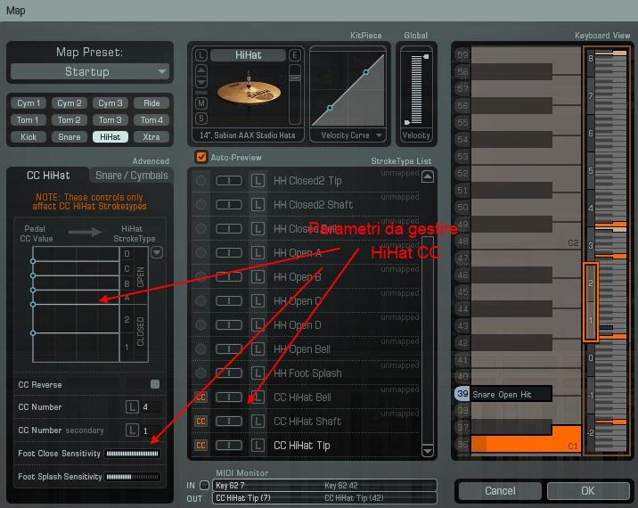

Per configurare il controller Hi-Hat con la soluzione di tipo
ON/OFF (interruttore semplice pulsante), è necessario
cortocircuitare tutti e tre i PIN relativi alla porta JACK dove
avete inserito la resistenza R1 (**può variare 15K - 1M
leggere sezione HiHat Variabile per maggiori dettagli**), in
questo caso S1/R1. Il corto lo potete fare o direttamente con
un jumper a tre, o tirando un filo sotto al jumper (in questo
esempio S1). Il pulsante sul JACK va invece collegato tra
massa(1) e lembo laterale(2), il sensore piezo sul JACK tra
massa(1) e lembo centrale(3). In questo modo con un'unica
porta JACK è possibile configurare un HI-HAT completo,
settando HHC come HEAD e Piezo come HH RIM in
Configuration (potrebbe essere il contrario), l'importante è
rilevare NOTE in monitor, quando si aziona il piezo e CC
quando si aziona il pulsante, (leggere la sezione di
ConfigTool per i settaggi).

## Hi-Hat Con Soluzione Variabile

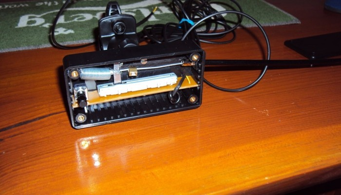

Si parte dalla configurazione scheda JACK per semplice pulsante ON-OFF sopra
descritta, pertanto corto su tutti e tre i pin (S1), si inserisce come partenza
una resistenza da 15-20K come R1, ed al posto del pulsante sul JACK, si collega
un potenziometro 50-100K (il sensore piezo rimane al suo posto e farà sempre il
TIP del piatto HiHat). Viene utile controllare la tensione misurata ai capi del
potenziometro, in quanto deve avere valori abbastanza vicini ai 4-5 V (forniti
dalla porta JACK senza carico), azionando il potenziometro si dovrà vedere
variare la tensione. Se questo non succede dovete iniziare a variale i valori
della resistenza R1 e cambiare il valore del potenziometro in quanto se si
utilizzano resistenze troppo alte su S1, probabilmente ci sarà poca tensione ai
capi e il potenziometro non sarà in grado di muovere l'asta variabile in
Addictive... Regolando questa sorta di partitore tra il valore della resistenza
messa in R1 e il potenziometro, dovreste essere in grado di vedere segnale in
ConfigTool e di conseguenza vedrete muoversi l'asticella in Addictive relativa
al settaggio HiHat...Come già scritto R1 (ed il potenziometro) possono variare in
funzione per esempio del modello del potenziometro a slitta stesso, che poi
andremmo ad utilizzare per creare una semplice ed efficace soluzione HiHat
variabile come quella rappresentata i figura. Se il potenziometro a slitta sarà
troppo corto avremo meno apertura dell'asta HiHat, se sarà troppo lungo sarà
esattamente l'opposto, ma chiaramente queste misure vanno poi anche ad incidere
sul modello del potenziometro stesso, pertanto bisogna trovare un buon compromesso...

## Configurazione Jack - microDrum

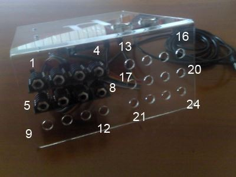

Porta 1) HiHat piezo/HHC foot on/off (pin in DrumMap, 1,2) resistenza e corto
Porta 2) Ride Dual Zone piezo/piezo (pin in DrumMap 3,0)
Porta 3) Snare Dual Zone piezo/piezo (pin in DrumMap 7,5)
Porta 4) Kick Dual Zone piezo/piezo (pin in DrumMap 4,6)
Porta 5) Extra/Crash piezo/switch on/off (pin in DrumMap 9,10) resistenza
Porta 6) Tom3 piezo/piezo (pin in DrumMap 11,8)
Porta 7) Tom2 piezo/piezo (pin in DrumMap 15,13)
Porta 8) Tom1 piezo/piezo (pin in DrumMap 12,14)
Dove il primo pin è solitamente il centro del jack, la configurazione base
prevede la resistenza da 120 omh (NO E' 1 M) montata sulla porta jack 1 con i
relativi corto per gestire un semplice HH a pulsante.

## Configurazione Jack Per Crash Con Choke

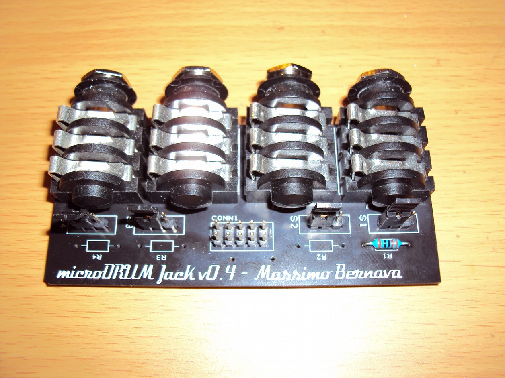

Per collegare un CRASH o RIDE con CHOKE tipo membrana on/off, è consigliabile
impiegare comunque una resistenza (può variare da 15K- 1 M comunque fate alcune
prove) e lasciare il jumper tutto a sinistra, senza fare alcun corto sotto i pin
del jumper (come invece si rende necessario per la soluzione HH). Il configtools
andrà settato PIEZO/SWITCH e si potranno assegnare i relativi suoni da Addictive
Drums in auto learn come di consueto. Probabilmente ci sarà da modificare i
parametri di treshold di configtools in funzine del tipo si switch che si andrà
ad utilizzare.

## Collegamento Connettori MIDI

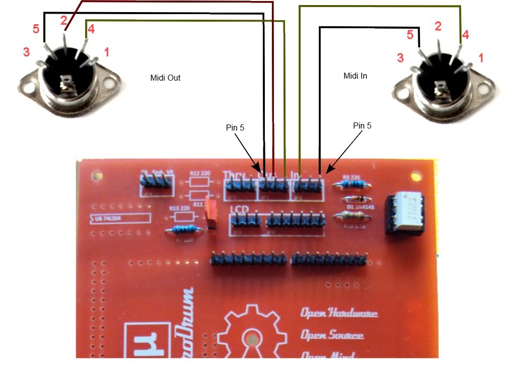

Non obbligatorio in quanto è possibile utilizzare la microDrum in **VIRTUAL MIDI**,
con software tipo loopMidi+Hairless, leggere la sezione dedicata.

## Firmware e Configurazione Funzioni di Base

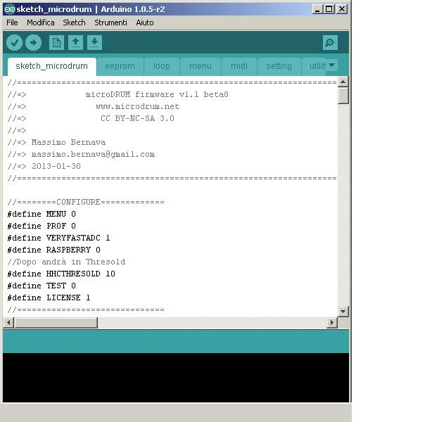
*Apertura del firmware microDrums mediante software Arduino.*

La modifica e l'invio del firmware alla microDrum per questioni di praticità,
viene qui descritto solo mediante l'uso del kit di sviluppo di Arduino stesso.
Pertanto vi invitiamo a scaricare il relativo software gratuito, nella sezione
download del sito del produttore prima di iniziare qualsiasi operazione di
aggiornamento o modifica.
Il firmware microDrum, viene solitamente fornito in una cartella compressa
denominata **md-firmware-master.zip**, decomprimete la cartella e, una volta
installato il software Arduino, dovreste essere in grado di aprire direttamente
il file **sketch_microdrum.ino** presente nella sotto cartella sketch_microdrum.
Quello è il file principale che andremmo qui a trattare per attivare alcune
funzioni di base; il file sketch_microdrum.ino è il file principale che serve
anche per generare ed inviare l'intero firmware.

> N.B: per aggiornare il firmware è necessario rimuovere il ponticello (jumper)
S1 sul circuito microDrum (leggere la sezione montaggio base).
Una volta inviato il nuovo firmware andrà inserito nuovamente il jumper S1
altrimenti allo spegnimento della microDrum si potrebbe perdere il firmware.

L'invio del firmware alla microDrum si effettua mediante la pressione del
bottone →. Si rimanda al manuale Arduino per configurazioni e utilizzo di tale
software.

**IMPORTANTE**: per testare il funzionamento di base della microDrum appena
montata senza l'impiego di altre componenti che potrebbero inizialmente generare
confusione, consigliamo di modificare la riga **#define RASPBERRY da UNO a ZERO**
nel firmware **sketch_microdrum.ino (su firmware più recenti questa riga potrebbe
risultare cambiata in #define SERIALSPEED)**.
Questa modifica permetterà di utilizzare direttamente microDrum sulla porta
seriale COMx(Arduino) in ConfigTool/Setup. Se tutto è corretto potrete
verificare in MONITOR i vari PIN e caricare un VST provvisorio, direttamente da
ConfigTool (leggete la sezione dedicata). Una volta che microDrum risponde bene,
sarà possibile rimettere il parametro a **UNO** (inviare nuovamente il firmware),
così da collegare la microDrum direttamente in MIDI mediante software
(loopMidi+Hairless) o adattatore MIDI. Il parametro **#define RASPBERRY a UNO
(o #define SERIALSPEED)** assieme ai software loopMidi+Hairless, permetterà di
utilizzare microDrum con un HOST VST esterno (tipo VST HOST o MINIHOST),
risolvendo anche i problemi di lentezza che si avrebbero utilizzando l'host di
test interno. L'opzione **GAIN** di configtools incide anche per rilevare i PIN,
pertanto **NON tenerlo a ZERO**.

## Configurazione Software ConfigTool per Test e Config di Base

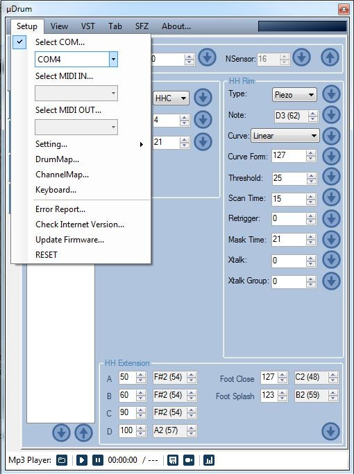

ConfigTool è il software di base per la configurazione della scheda microDrum;
la prima cosa da fare dopo aver montato la scheda, installato il driver di
gestione (se non già direttamente riconosciuta dal sistema), inviato il firmware,
è selezionare in SETUP, la porta di comunicazione corretta (vedere in sistema,
porte COM cercare Arduino su COMx).

**IMPORTANTE: prima di fare tutte queste configurazioni e test di base, leggere
la sezione FIRMWARE per impostare correttamente la microDrum, altrimenti non si
vedrà nessun segnale.**

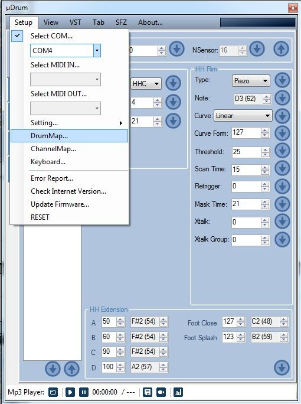

Se avete preso la versione già assemblata, la microDrum viene fonita con una
configurazione base precaricata, qualora vogliate modificarla dovete agire
mediante DrumMap dal menu Setup. Tale funzione vi permetterà di assegnare o
modificare i PIN/PAD di ingresso microDrum che sono la base da cui partire.

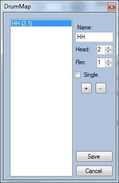

DrumMap gestione PIN/PAD, serve per assegnare le componenti della batteria ai
PIN (ingressi) microDrum. Inserendo un nome nell'apposito campo ed agendo sul
pulsante + o –, inserirete o toglierete i PIN (ingressi per piatti, tamburi, HH).
Per ricavare o verificare i PIN corretti (possono variare a secondo del montaggio
/+ o - corretto dei cavi colorati JACK), potete andare in TOOLS (foto qui a fianco);
DrumMap permette di attivare la singola o doppia zona (flag Single), ogni presa
JACK è stereo, pertanto dual zone, ma ci sono condizioni che possono generare
fenomeni di crosstalk non sempre risolvibili, che potrebbero ridurre il numero
di ingressi.
Per evitare errori fate un PIN per volta, salvate i file di configurazione .ini
(uscendo completamente dal programma), rientrate nel programma, ricontrollate e
procedete all'inserimento di un altro PIN. Una volta creata una configurazione
sicura e funzionante la potete inviare definitivamente alla microDrum (leggere
la sezione relativa al salvataggio dati). Evitate configurazioni complesse in un
unico colpo, fate un PIN alla volta per evitare accavallamenti o malfunzionamenti
poi difficili da sistemare.
Ricordatevi che le configurazioni SWITCH o HHC richiedono alcune modifiche
all'hardware (resistenza o ponticelli) come descritto all'interno di questo manuale.

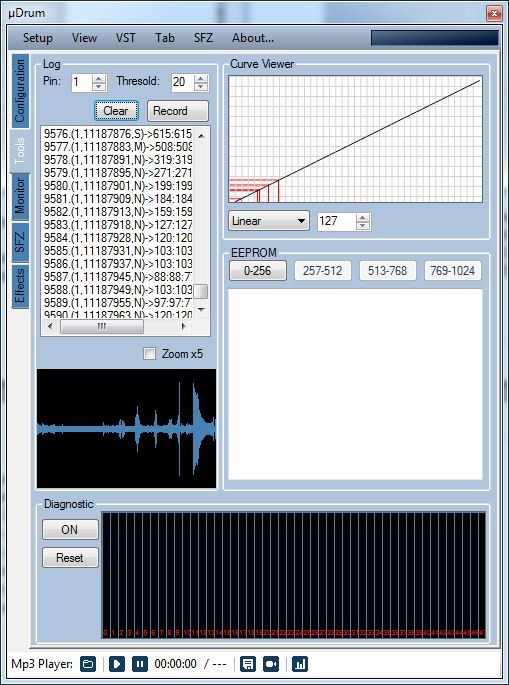

Tools permette di verificare quale PIN è attivo. Spostando il selettore Pin
(da 1 a 48) ed inserendo i jack uno alla volta nelle prese, dovreste vedere
il segnale. Prendete nota del numero di PIN relativo alla porta JACK, vi
servirà per effettuare le configurazioni in DrumMap e inserire i Jack in
maniera corretta. Per ridurre la quantità di dati a video (in alcuni casi
possono causare crash del software), potete alzare Thresold. In questa
fase potreste notare delle spurie (intrinsiche nell'hardware tra i vari PIN),
provate fino a quando trovate un segnale reale e pieno; la licenza base del
software ConfigTool, prevede un massimo di 16 PIN (ingressi)
configurabili, non è detto che i PIN siano in sequenza da 1 a 16.

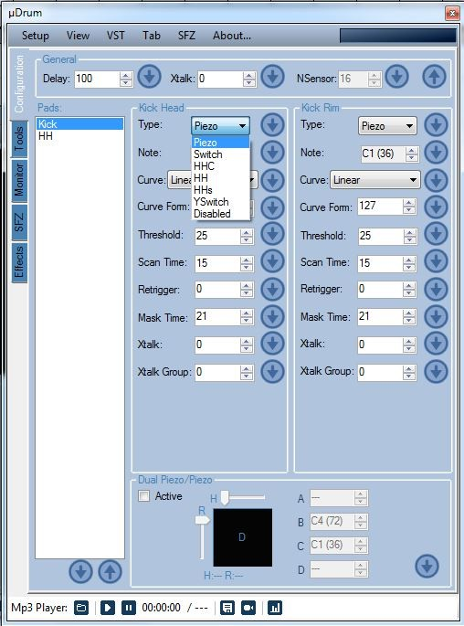

Una volta aggiunta una componente (PAD,HH ecc.) mediante DrumMap, in Configuration
avrete la possibilità di modificare i parametri, diverse opzioni si abilitano in
funzione del tipo di configurazione scelta, potete inviarle alla microDrum e
testarle mediante il pulsante freccia verso il basso.
Uscendo dal programma si salveranno nel file .ini di configurazione in automatico.

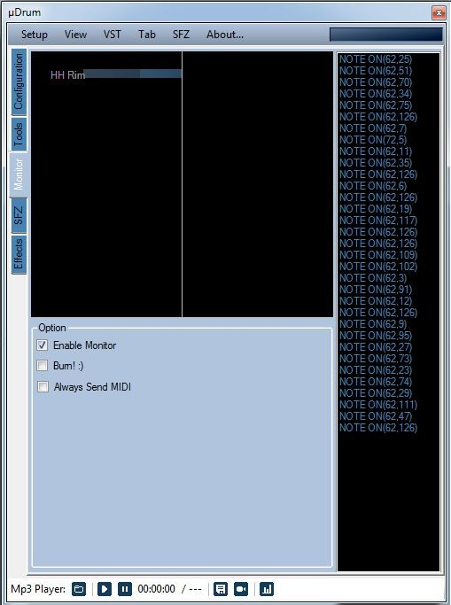

Monitor vi permette di verificare la configurazione.
Toccando i vari sensori (piatti,tamburi), si dovrebbe attivare un indicatore a
barra,oltre a vedere la nota MIDI associata. In questo monitor si possono vedere
segnali crosstalk (spurie intrinsiche nell'hardware), da gestire mediante i
parametri (Threshold ecc.). Per il test con un VST caricato direttamente in
Configtools, dovete lasciare monitor attivo, altrimenti non vengono inviati i
dati al VST.

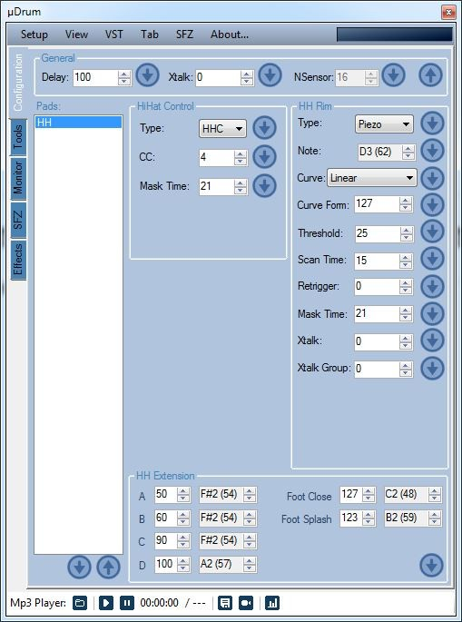

Esempio configurazione HI-HAT modalità semplice pulsante ON-OFF configurazione CC
(usata in Addictive Drums), singola porta Jack piezo e semplice pulsante on/off.

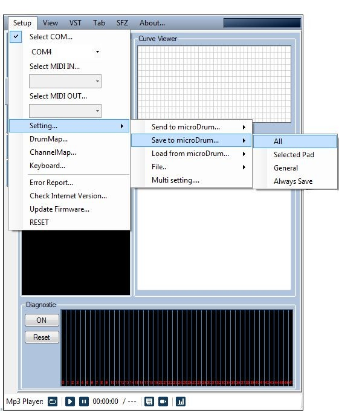

Trovata una configurazione potete salvarla nella microDrum, mediante la funzione
Setting, Save to Microdrum, All. Mentre per salvare i parametri inseriti in
ConfigTool basta chiudere il programma (pertanto in caso di crash il programma
non salva gli ultimi settaggi inseriti).

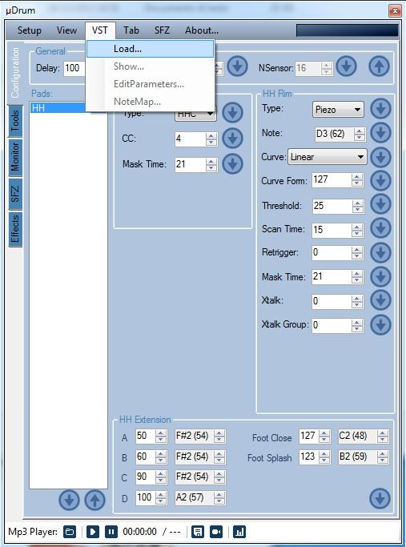

Mediante il menu VST è possibile caricare il VST Addictive Drums (o simili) e
verificare la configurazione.
Configtools permette di caricare direttamente plug-in VST senza ulteriori
software o cavi MIDI, ma al solo scopo di test e configurando opportunamente le
opzioni nel firmware. In questa configurazione di test, il VST genera latenza,
pertanto difficilmente utilizzabile per suonare (consultare la sezione FIRMWARE
per maggiori dettagli). Per gestire correttamente il VST dopo averlo caricato,
**Configtools deve essere nella finestra Monitor**.

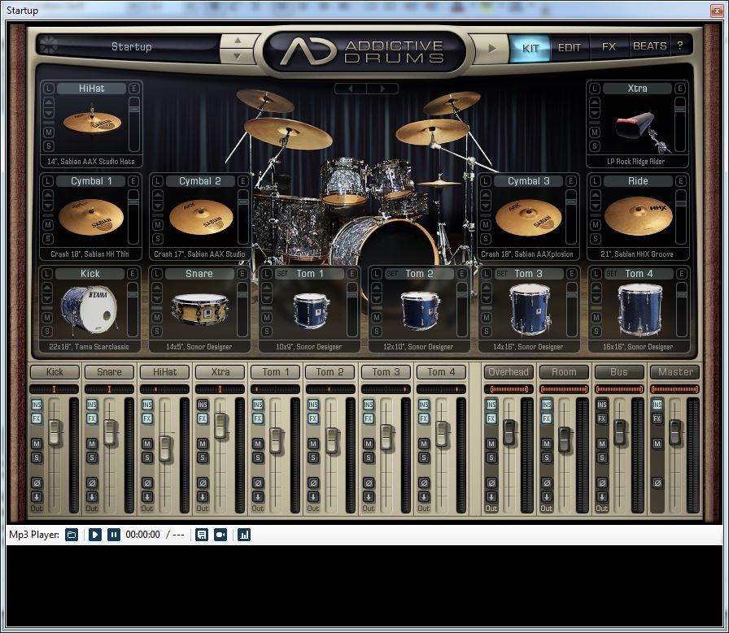

VST Addictive Drums caricato all'interno di Configtools a scopo di test.

## Configurazione Virtual MIDI microDrum

ConfgTools può essere impostato per gestire la microDrum mediante protocollo MIDI
anche senza disporre di cavo interfaccia MIDI, ma mediante programmi esterni quali
loopMidi e Hairless. Procurarsi le versioni più aggiornate di tali programmi
direttamente dal sito dei produttori, installarli e configurarli in maniera
corretta (seriale 115000 che è quella impostata nel firmware microDrum). Per
informazioni sui parametri e licenza d'uso dei software loopMidi/Hairless, si
rimanda alla documentazione dei rispettivi produttori.

Dovete ricordarvi di deselezionare in ConfigTool la porta seriale in SETUP
quando si intende utilizzare microDrum in MIDI, e ri-spuntarla/attivarla SOLO
quando si intende inviare modifiche ai parametri di configurazione della microDrum
stessa. Attivate la gestione MIDI spuntando **Select MIDI in/MIDI out**, cercando
nell'elenco la porta MIDI virtuale creata con **loopMidi** e rigirata sulla
seriale Arduino mediante **HairLess**. Durante questi passaggi si rende necessario
spostarsi tra le funzioni di **ConfigTool**, (monitor/configuration) fino ad
ottenere la reale attivazione/disattivazione delle modifiche apportate, potete
controllare il LED dell'Arduino sulla microDrum, in modalità **SERIALE** si noterà
il LED blinkare ad oltranza, mentre quando è attivo il **MIDI** il LED, (se tutto
è configurato come dovrebbe), si accenderà solo quando un segnale MIDI attraversa
la microDrum (toccando un sensore per esempio).
Questa semplice verifica visiva vi aiuterà a capire se la microDrum è realmente
attivata per gestire il Midi e se i vari software sono configurati correttamente.
Si otterrà così una porta MIDI loopMidiPort_X gestibile dai vari HOST VST
gratuiti tipo VST HOST che colloquierà direttamente con microDrum.

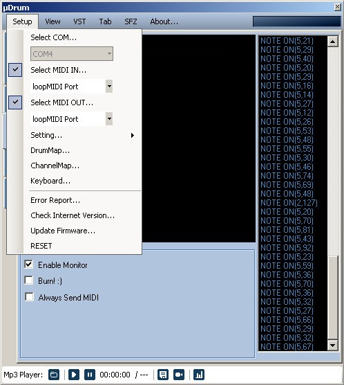

Se tutto è configurato correttamente dovreste vedere in MONITOR attivarsi il
relativo PIN/PAD. Una volta inizializzata e verificato che funziona tutto via
MIDI, volendo è possibile chiudere ConfigTool e utilizzare il VST tramite l'HOST
e i relativi software loopMidi+Hireless.

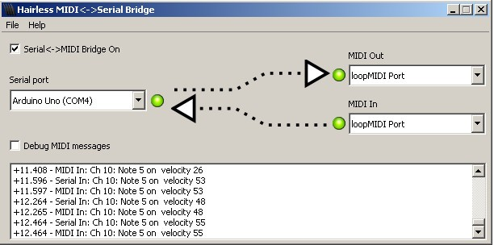

Hairless si aggancia alla porta MIDI creata con loopMidi. Se tutto è corretto i
led verdi del programma si dovranno attivare SOLO quando vi è un segnale MIDI
(abilitando il Debug sarà anche possibile vedere i messaggi MIDI). Se i LED
lampeggiano ad oltranza, dovrete controllare tutte le configurazioni a partire
dal settaggio corretto nel firmware microDrum.

LoopMIDI crea porte virtuali le quali vengono gestite direttamente come
interfaccie MIDI nei programmi tipo HOST VST. L'aggancio a Hairless serve per
far parlare la microDrum a loopMidi.
