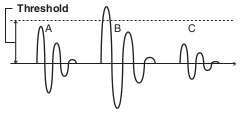
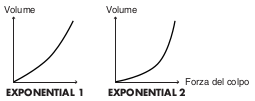
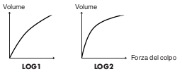
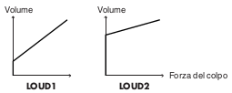
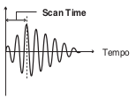
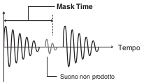
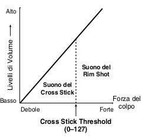

## BASIC

### Sensibilità del Pad (1 - 32)

Potete regolare la sensibilità dei pad a seconda del vostro stile esecutivo
personale. Questo vi permette di ottenere un controllo più dinamico del volume
del suono, a seconda della forza con cui suonate.
Una sensibilità maggiore vi permette di produrre un volume più intenso anche
quando suonate piano.
Una sensibilità inferiore fa si che il pad produca un volume più basso anche
quando suonate con forza.

### Threshold (Livello minimo del pad, 0 - 31)

Questa impostazione permette di ricevere il segnale di trigger solo quando il
colpo supera un livello di forza (velocity) determinato. Questo può essere
utilizzato per evitare che un pad suoni a causa delle vibrazioni degli altri pad.
Nell’esempio sotto, B suona, ma A e C non suonano.

Con valori maggiori, non si produce alcun suono quando suonate il pad delicatamente.
Alzate gradualmente il valore di “Threshold” mentre suonate il pad. Controllate
e regolate conformemente. Ripetere il processo sino ad ottenere l’impostazione
più adatta al vostro stile.

### Velocity Curve (Come la Dinamica dell’Esecuzione Cambia il Volume)

Questa impostazione vi permette di controllare la relazione tra la dinamica
dell’esecuzione (forza dei colpi) e i cambiamenti di volume. Regolate questa
curva sino a quando la risposta non risulta il più naturale possibile.

**LINEAR**

L’impostazione standard. Produce la corrispondenza più naturale tra dinamica e
cambiamenti di volume.

**EXP1, EXP2**

Rispetto a LINEAR, dinamiche più intense producono un maggior cambiamento.

**LOG1, LOG2**

Rispetto a LINEAR, dinamiche meno intense producono un maggior cambiamento.

**SPLINE**

Avvengono cambiamenti estremi in risposta alle dinamiche dell’esecuzione.

**LOUD1, LOUD2**

Risposte alla dinamica molto ridotte, che rendono semplice mantenere livelli di
volume intensi. Se usate trigger per tamburi acustici, queste impostazioni vi
aiutano a mantenere livelli stabili.

## XTALK (Eliminare le Interferenze tra i Pad)

Quando due pad sono montati sullo stesso supporto,
colpendo un pad si potrebbe innescare il suono dell’altro pad in modo involontario.
(Questo prende il nome di **diafonia**). Questo problema può essere eliminato
regolando il parametro Xtalk Cancel del pad che suona inavvertitamente.

*In certi casi, potete eliminare le interferenze tra i due pad aumentando la
distanza tra loro.*

**Esempio di interferenza: colpite il pad del rullante e suona anche il tom 1**

Impostate il rullante e il tom 1 sullo stesso XTALK GROUP. Alzate l’“XTALK CANCEL”
del pad che viene usato per il tom 1. Il pad del tom 1 ora ha meno possibilità di
ricevere le interferenze dagli altri pad. Con l’impostazione “OFF,” la prevenzione
delle interferenze non funziona.

> Se il valore impostato è troppo elevato, e i due pad vengono suonati
simultaneamente, quello che viene colpito con minor forza potrebbe non suonare.
Fate attenzione e impostate questo parametro sul valore minimo necessario per
evitare le interferenze.

## ADVANCE (Parametri Trigger Avanzati)

### Scan Time (Tempo di Rilevamento del Segnale di Trigger, 0 - 4.0 ms)

Poiché il tempo di salita della forma d’onda del segnale di trigger può variare
leggermente a seconda delle caratteristiche di ogni pad o trigger per tamburi
acustici (drum pickup), potreste notare che colpi identici (per intensità)
possono produrre suoni a volumi differenti. In questi casi, potete regolare lo
“Scan Time” così che il modo in cui suonate possa essere rilevato in modo più
preciso.

Colpendo ripetutamente il pad con una forza costante, alzate gradualmente il
valore dello Scan Time da 0 msec, sino a quando il volume risultante non si
stabilizza al livello più intenso. Con questa impostazione, provate sia colpi
deboli che forti, e controllate che il volume cambi in modo appropriato.

> Alzando il valore, aumenta il tempo necessario per produrre il suono. Perciò
impostate il valore più basso possibile.

### Retrigger Cancel (Attenuazione del rilevamento del segnale di trigger, 1 - 16)

Importante se state utilizzando trigger per tamburi acustici. Tali trigger
possono produrre forme d’onda alterate, che possono produrre anche suoni
indesiderati nel punto A della seguente figura (**Retrigger**).

Questo avviene in particolare nella fase di decadimento della forma d’onda.
Retrigger Cancel rileva tale distorsione e impedisce il verificarsi del reinnesco.

Colpendo ripetutamente il pad, alzate il valore di “Retrig Cancel” sino a che
non si verificano più reinneschi.

> Benché impostando questo parametro ad un valore l’alto si impediscano i
retrigger, è più facile che i suoni vengano omessi quando il tamburo viene
suonato velocemente (rullate, etc.). Impostatelo sul valore minimo possibile che
consente di impedire i reinneschi indesiderati.

*Potete anche eliminare questo problema di retrigger con l’impostazione Mask Time.
Mask Time non rileva i segnali di trigger che avvengono entro la quantità di
tempo specificata dopo aver ricevuto il segnale di innesco precedente. Retrigger
Cancel rileva l’attenuazione del livello del segnale di trigger, e innesca il
suono dopo aver determinato internamente quali segnali di trigger sono stati
effettivamente generati quando è stata colpita la pelle, eliminando gli altri
segnali di trigger falsi che non devono innescare il suono.*

### Mask Time (Prevenzione dei Doppi Inneschi, 0 - 64 ms)

Quando suonate un kick per la cassa il battente può rimbalzare e colpire la pelle
una seconda volta immediatamente dopo la nota desiderata — con i tamburi acustici
certe volte il battente resta contro la pelle — questo fa si che un singolo colpo
provochi un “doppio trigger” (due suoni invece di uno). L’impostazione Mask Time
vi aiuta a evitare questo problema. Dopo che un pad è stato colpito, qualsiasi
segnale di trigger aggiuntivo che avviene all’interno del “Mask Time” (0–64 msec)
specificato viene ignorato.

Regolate il valore del “Mask Time” mentre suonate il pad.
Quando suonate un kick trigger, provate a lasciar rimbalzare il battente così che
colpisca la pelle molto velocemente, poi alzate il valore del “Mask Time” sino a
quando non vi sono più suoni provocati dal rimbalzo del battente.

> Con un valore elevato, diventa difficile suonare molto velocemente.
Impostate il valore più basso possibile.

*Se si generano due o più suoni quando colpite la pelle solo una volta, allora
regolate Retrig Cancel.*

### Rim Gain (Risposta dinamica Rim/Edge, 0 – 3.2)

Quando è collegato un pad PD-125/120/105/85/80R, PD-9/8/7, serie CY, VH-12/11, o
RT-5S (trigger), potete regolare la relazione tra la dinamica della vostra
esecuzione (forza) sul cerchio/bordo e il livello di volume prodotto.
Valori più elevati permettono al cerchio/bordo di produrre un volume intenso
anche quando suonate piano. Valori bassi fanno si che il cerchio/bordo produca
un volume basso anche quando viene suonato con forza.

### Rim Shot Adjust (Risposta ai Rim Shot, 0 – 8.0)

Quando è collegato un PD-125/120/105/85/80R o RT-5S (trigger), potete regolare
la sensibilità della risposta del cerchio.
Vi sono casi in cui suona anche il cerchio inaspettatamente quando colpite con
forza la pelle. Potete migliorare la situazione riducendo il valore di
“RimShot Adjust.”

> Quando impostate un valore troppo basso, può essere difficile produrre il
suono del cerchio.

### XStick Thrshld (Cross Stick Threshold, 0 – 127)

Quando è collegato un PD-125/120/105/85/80R o RT-5S (trigger), potete determinare
il “punto di incrocio” tra i suoni del cross stick e il rim shot.

Impostando questo parametro ad un valore elevato è più facile ottenere i suoni
del cross stick. Quando è impostato a “0,” suonando un cross stick si produce il
suono dell’open rim shot.

> Alzando eccessivamente il valore, potrebbe suonare il cross stick anche quando
eseguite un open rim shot.

