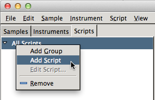
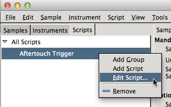
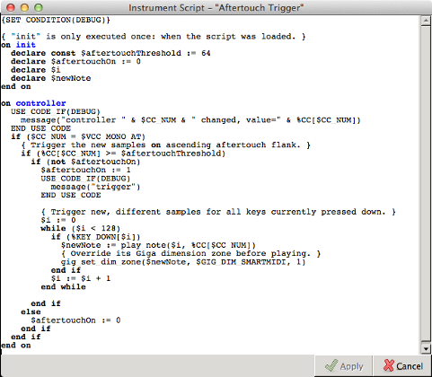
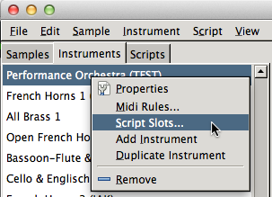
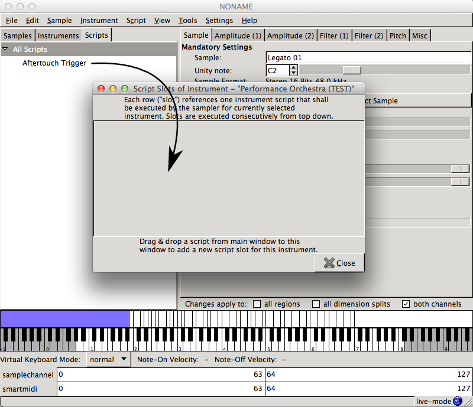
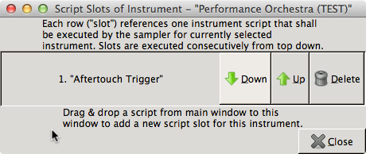

<link rel="stylesheet" href="/linuxsampler/style.css">

Gigedit and LinuxSampler provide support for so called *real-time instrument
scripts*. You can use such scripts to add your own software extensions to the
sampler, in order to customize and/or extend the sampler's software behaviors and
features, specifically to satisfy particular software features required for some
of your sounds.

This article describes how to manage instrument scripts with Gigedit, that is how
to add scripts to your GigaStudio files and how to apply them to your sounds. If
you rather want to find out more about instrument scripts in general or learn
about the details of this programming language, then please refer to the
[Real-Time instrument Scripts manual](../nksp).

> Instrument scripts is a feature extension of the GigaStudio file format which
is only available with Gigedit and LinuxSampler. Instrument scripts are not
supported by the original GigaStudio software.

### Adding Scripts

Before you can apply scripts to some of your sounds, you first need to add the
instrument script to your GigaStudio file. Once you added a script to your
GigaStudio file, the script can then be assigned to one or several instruments
of that GigaStudio file.

To add a new instrument script to your GigaStudio file, click on the "Scripts"
tab, then *right click* on the script list view and select "Add Script". A new
empty script has now been added to your GigaStudio file. Like with instruments
and samples you may now *click twice* on the new script in the script list and
rename the script to something meaningful.

### Editing Scripts

The new script is yet empty. To add some code to the script, or to modify an
existing script, select the respective script name in the list view, then *right
click* on that script name and select "Edit Script".

The script editor has now appeared on your screen. Enter or edit the code for the
script with your keyboard. Once you are done, click on "Apply". Close the script
editor and select "Save" from the menu to save your GigaStudio file with your
new script.

*NKSP Instrument Script Editor*

To learn the NKSP script language in order to write or customize such scripts,
please refer to the [NKSP Language Manual](../nksp/language).

### Assigning Scripts to Instruments

Like with samples, scripts are stored on a global level in GigaStudio files and
are shared by all instruments of that GigaStudio file. That means you may assign
a script to several of your instruments, which are only storing a reference to
that script. If you later on change the script code, all instruments will
automatically have that updated script.

To assign a script to one of your instruments, select the "Instruments" tab,
then select the name of the instrument in the instrument list view, then *right
click* on the instrument name and select "Script Slots...".

A new window appeared (like below), showing you all scripts currently assigned
to that particular instrument. Now select the "Scripts" tab on the main window
and *drag* the script you want to assign to your instrument from the script list
view to the center of the script slots window.

The script slots window now updated and shows you a new row with the name of the
script that you just added.

*Script 'Aftertouch Trigger' assigned to the instrument 'Performance Orchestra'.*

Close the script slots window and select "Save" from the menu to make your script
assignment persistent to your GigaStudio file.

<note class="important">
Even though Gigedit allows you to assign more than one script to an instrument,
this is not yet supported by LinuxSampler. If you load an instrument with
multiple script slots into LinuxSampler, then LinuxSampler will currently only
load the instrument's first script slot and show you a warning on the console
that it ignores all other scripts assigned to that instrument. This will change
in future.
</note>

 

<a href=".">↑ Gigedit</a>

