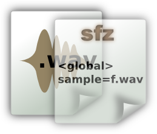

This site offers various documentation, manuals and articles about applications
and sofware components of the LinuxSampler project.

---

<table class="goverview">
<tr><td>

<a href="gigedit" title="Gigedit: An instrument editor for the GigaStudio file format.">Gigedit Instrument Editor</a>
</td><td>

<a href="sfz" title="SFZ File Format: SFZ File Format Reference.">SFZ File Format</a>
</td><td>

<a href="nksp" title="Instrument Scripts: Introduction to real-time instrument scripts.">Instrument Scripts</a>
</td></tr>
</table>

> **NOTE** This documentation site is currently in a transition phase. Most of
the old manuals and documents of the LinuxSampler project will be moved to this
site. However this process has not been completed yet. You may want to refer to
some of the [old documentation](http://www.linuxsampler.org/documentation.html)
in the meantime.
