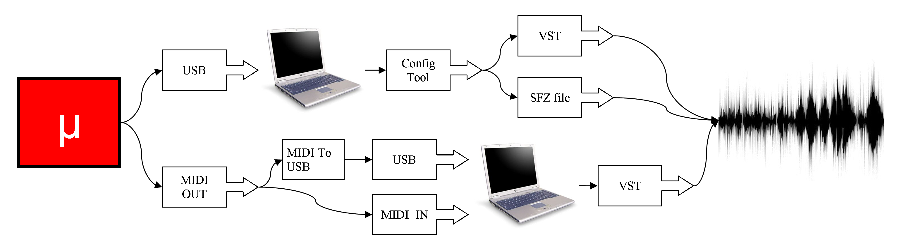

The microDRUM is a Trigger-to-MIDI controller. In practice, as shown in the drawing,
the microDRUM converts impulses generated by a pad (or cymbal) into a MIDI note.

To allow the PC to receive the MIDI note, the PC must have a MIDI port or a
USB-MIDI converter. The PC will then turn the MIDI note into sound.
In order to do this, you'll need special software called a Vst Plugin,
or Virtual Studio Technology plugin. If your PC doesn't have a program that can
host the Vst plugin, you can use the config-tool as a host for a Vst.
If you do this, you do not need to use the midi port, only a USB port, as you
can see in the picture below. Also, through the config tool, you can upload SFZ
files and use it without a Vst.

The idea behind the microDRUM is to create opportunities for anyone to build a
drum machine in an economical way. To do this the heart of microDRUM is Arduino (see).

## Features

* 48 trigger inputs.
* MIDI in/out port
* USB port (allowing the configuration of the microDRUM)
* Customizable settings to eliminate multiple-triggering, cross-talk, etc ...
* Supports most types of switch or variable HiHat controllers with CC position
  or dedicated notes on all zones for 6 levels of intermediate levels of the
  pedal positions.
* Save setting on internal EEPROM
* And more… 
