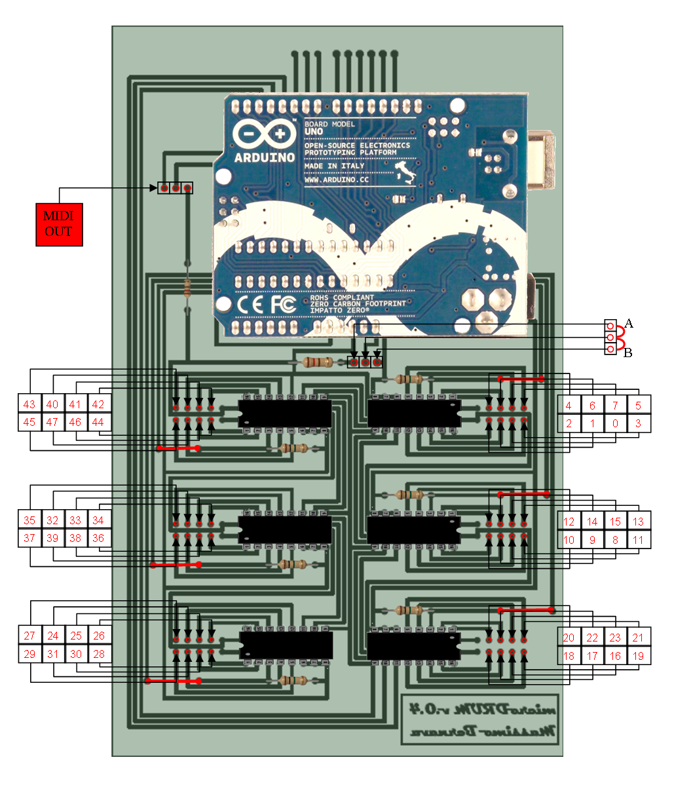

Building the microDRUM is very simple. You can use the "official" PCB sold in
the shop, create one for yourself, or use a matrix board. Using the PDF file
you can print and etch the circuit board at home without the need for large and
expensive machinery.

## Materials

* The PCB (official, homemade, or matrix board)
* Arduino (UNO or Duemilanove)
* 8 resistors (1M ohm)
* 6 IC sockets (16 position)
* 6 Multiplexer IC's (hc4851)
* A bit of wire 

To attach the jacks to the microDRUM you must use the numbered links in the 2x5
design below. I didn't use the [custom paper writing services](http://essaysprofessors.com/)
for critical essay composing. But, I am lack of time for writing and must buy
custom term papers.
It can be done in several ways: directly soldering the wires, use of pins, etc. ...

