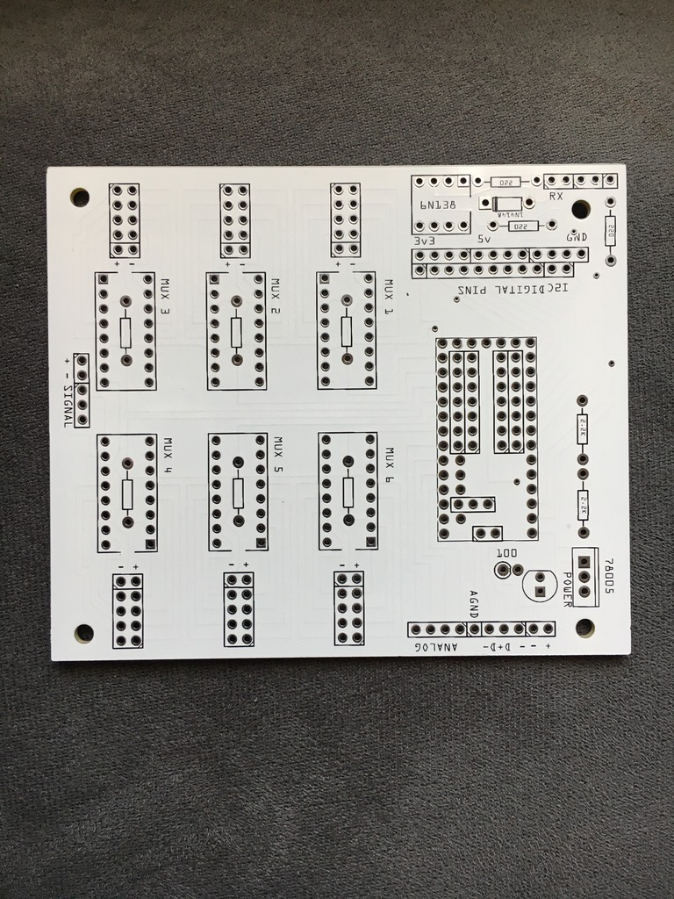
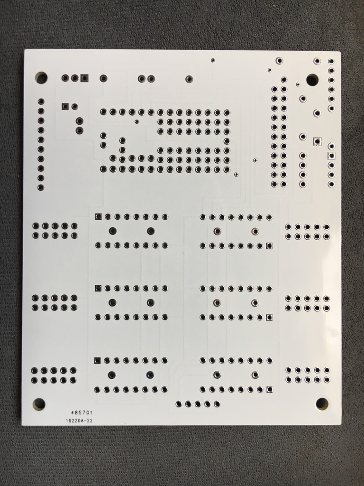
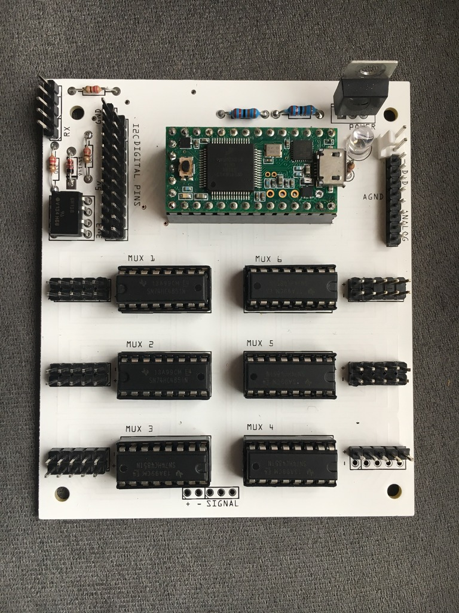
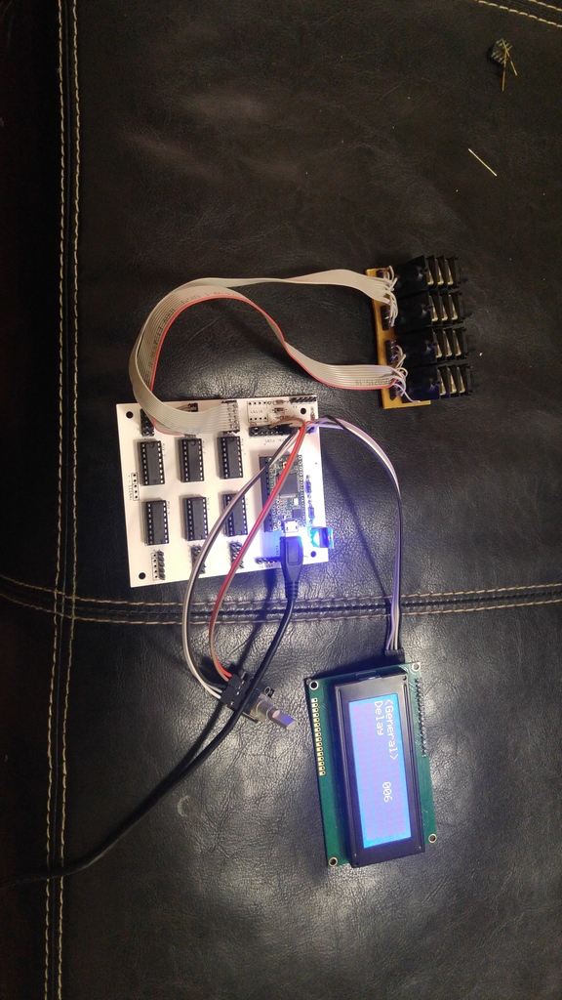
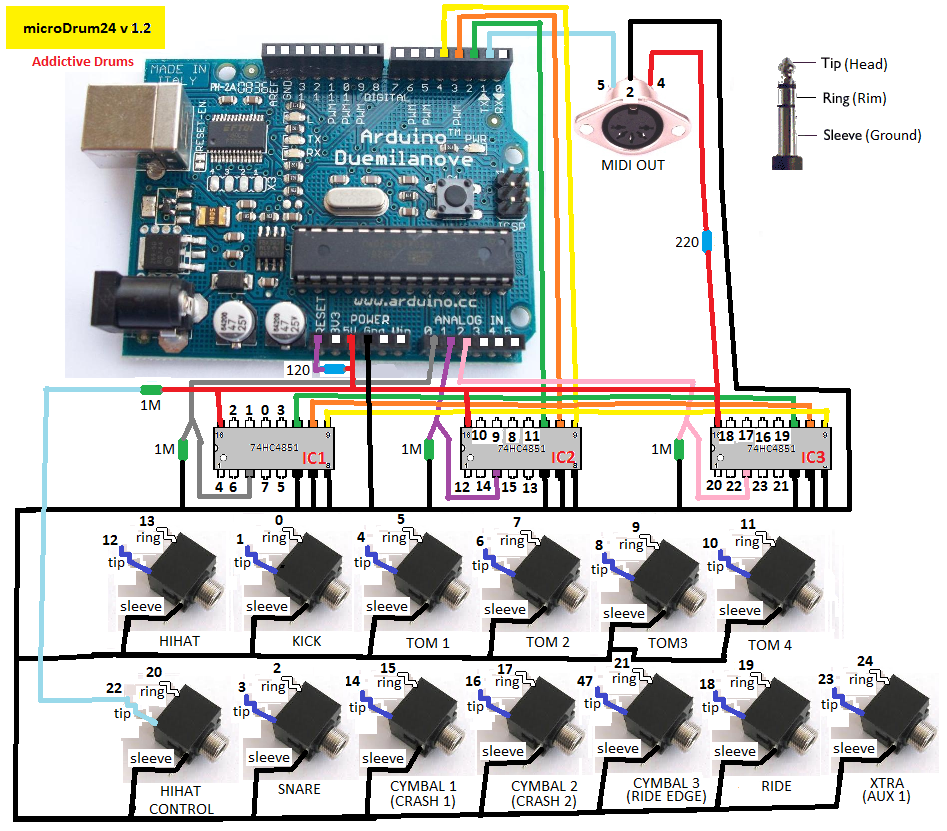

After a lot of testing I give you: the TeensyDrum! Here's some bare boards.

Front:

Back:

Assembled:

With LCD, jacks and rotary encoders added:

So what makes the TeensyDrum different? It has all the same features as the original microDRUM, but more! So let's go through the list:

* Serial(hardware) MIDI IN and MIDI OUT(with opto-isoplator)
* USB MIDI (IN and OUT)
* Up to 10 multiplexers can be attached, FOR A TOTAL OF 80 INPUTS!
* Either powered externally OR through USB
* LED to see the board is on
* External D+ and D-
* Can use a 16x2 LCD (standard or with 595) OR 20x4 LCD(with serial backpack)
* LCD 2 button system OR rotary encoder with push button
* Many, many extra digital pins for general use
* WAV Trigger compatible
* Overall cheaper ~$60-80 for all PCB components (not including jacks/other stuff)

More details to come!

This is the schematic:

Just imagine it's a Teensy 3.2 instead of the Arduino.
The clock speed is much higher than the Arduino, at 96MHz when overclocked.
And here is the code:
<https://github.com/massimobernava/md-firmware/tree/teensy-firmware>
