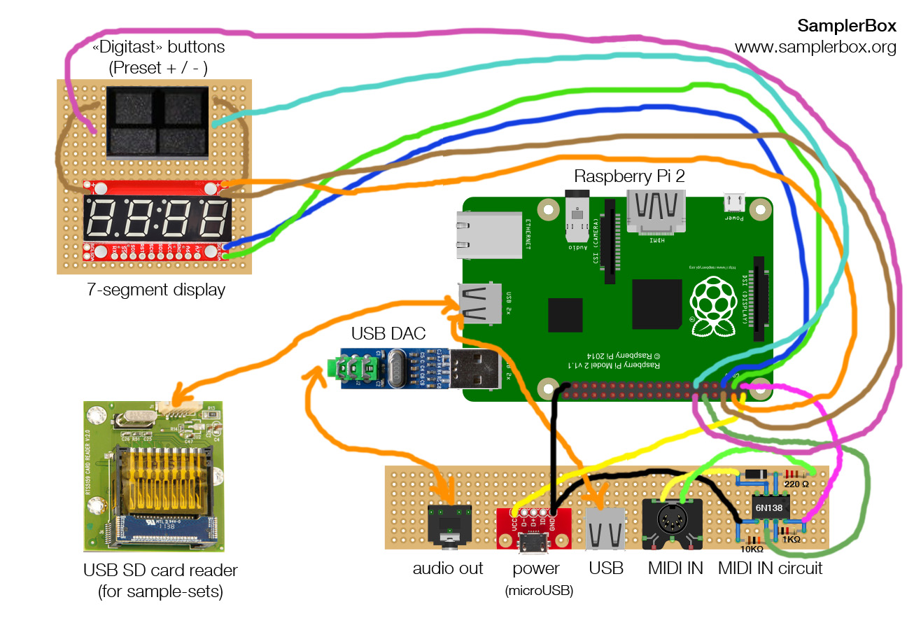

## Schematics

## BILL OF MATERIALS

| Qty | Descr.                                | Cod.      |
| -   | ------------------------------------- | --------- |
| 1   | Raspberry Pi 2
| 1   | SparkFun 7-Segment Serial Display Red | COM-11441
| 1   | Audio card dongle USB DAC PCM2704
| 1   | PCB SD card reader                    | RTS5159
| 1   | Sparkfun microUSB breakout            | BOB-12035
| 1   | 3.5mm stereo jack socket
| 1   | USB A connector (for PCB)
| 2   | Digitast switch
| 1   | MIDI socket
| 1   | veroboard / perfboard
| 16  | female-female Dupont cable
| 1   | 36 pin header
| 1   | 220Ω resistor
| 1   | 10 KΩ resistor
| 1   | 1 KΩ resistor
| 1   | 1N4148 diode
| 1   | 6N138 optoisolator
