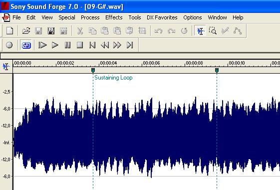

### 1. Q: What is SamplerBox, and why this project?
A: SamplerBox is an electronic musical instrument. Drop audio samples onto it,
hook up a MIDI keyboard, and you'll be able to play with realistic piano, organ,
drums, etc. sounds!
As strange as it may sound, if you wanted to add great piano sound to your MIDI
keyboard or synthesizer, there was previously no hardware solution except using
a computer (ok it works, but sometimes you don't feel like using a computer to
do music) or buying an expensive sampler / expander. Now SamplerBox provides
a sub-99€ solution!

### 2. Q: What kind of MIDI keyboads can I connect to SamplerBox?
A: There is no limitation about MIDI keyboards. Both USB MIDI keyboards (with a
USB plug) and MIDI (with a MIDI plug) are accepted. You can use small 25-keys
keyboards, such as the Akai LPK25 we use in some videos ; you can use 49 keys
MIDI keyboards, or even 61 keys or 88 keys if you want!

### 3. Q: Where can I find instrument sample-sets to use with SamplerBox?
A: You can find some instruments [here](http://www.samplerbox.org/instruments).
But you can also do some sample-sets yourself in a few seconds only
(no sample-set-making skills required)!
See questions [#5](#5-q-how-to-create-my-own-sample-set-to-use-with-samplerbox-easy)
and [#6](#6-q-how-to-create-my-own-sample-set-to-use-with-samplerbox-advanced).

### 4. Q: Is velocity sensitivity possible?
A: Yes. See question [#6](#6-q-how-to-create-my-own-sample-set-to-use-with-samplerbox-advanced).

### 5. Q: How to create my own sample-set to use with SamplerBox? (easy)
A: If your samples are numbered by their usual MIDI note like this: 36.wav,
37.wav, ..., you just need to put these files in a folder named like this:
```/1 Piano/```, ```/17 Trumpet/```, ..., i.e. a number + a white space + a name.
The number will be the preset number.
No sample-set definition file required in this simple case!

### 6. Q: How to create my own sample-set to use with SamplerBox? (advanced)
Sometimes, a picture speaks more than words, so don't forget to look at
[this blog article](http://www.samplerbox.org/article/howtocreateasampleset)
before reading what follows.

If your samples are not named like 36.wav, 37.wav, and/or you want advanced
features like many velocity layers, you need to create a folder (as described
before) and have a ```definition.txt``` file in it.
Let's say your samples are:
```
/1 PIANO/MyPiano_60_vel70.wav
/1 PIANO/MyPiano_60_vel100.wav
/1 PIANO/MyPiano_61_vel70.wav
/1 PIANO/MyPiano_61_vel100.wav
...
```
Then just create a file named ```/1 PIANO/definition.txt``` containing this single line:
```
MyPiano_%midinote_vel%velocity.wav
```
Then SamplerBox will automatically detect and assign all the .wav files to the
right notes and velocity layers! It's magic!

### 7. Q: Is it possible to change the MIDI channel and load two patches at once? (Let’s say bass samples on channel 1 and horn samples on channel 2?)
A: Currently SamplerBox reads all incoming MIDI notes, regardless the MIDI channel.
But MIDI channel handling could be easily added, if this feature is really requested.
Loading two patches at once is currently unsupported.

### 8. Q: Where should I put the sample-sets?
A: If you installed SamplerBox via the [image file](http://www.samplerbox.org/makeitsoftware)
(RECOMMANDED INSTALL), you have to put the sample-sets on a USB-stick
(or on a SD card in a USB SD card reader)
that you will plug into the RaspberryPi. This USB-stick / SD card should contain
folders containing your .WAV samples, like this:
```
/0 Piano/
/1 Flute/ 
...
```
Why not using the RaspberryPi's built-in microSD card? Two reasons:

1. Because SamplerBox is a box! The user doesn't normally have access to the
   internal microSD card. The internal microSD card is used for OS and software,
   not for user sample-sets!
2. Because you want to be able to plug in / remove / plug another SD card into the
   SamplerBox live! This wouldn't be possible by using the internal microSD card.

If you installed SamplerBox via the [MANUAL INSTALL](http://www.samplerbox.org/makeitsoftware),
you can change the config in one line to use whatever you want as the sample-set
source directory.

### 9. Q: How to change the current preset?
A: Most MIDI keyboards have buttons called ```PROGRAM +``` / ```PROGRAM -```
that will send ProgramChange MIDI messages. These MIDI messages are used to
change SamplerBox's current preset. How to change the current preset if you
don't have such buttons on your keyboard? Use SamplerBox's [hardware buttons](http://www.samplerbox.org/article/anotherprototype):
it's exactly what they are made for!

### 10. Q: What audio formats are supported?
A: SamplerBox uses standard WAV files, stereo or mono, 16 bits or 24 bits, at a
sampling rate of 44.1 Khz. It doesn't support AIFF, MP3, OGG, FLAC, etc. files.

### 11. Q: Do I need a Raspberry Pi 2 or will it work as well with a Raspberry B / B+ ?
A: It will work on a Raspberry Pi B / B+, but better performances / higher
polyphony will be achieved with a Raspberry Pi 2.

### 12. Q: How to put the SamplerBox image file, on a microSD card?
A: See instructions [here](https://www.raspberrypi.org/documentation/installation/installing-images/README.md).

### 13. Q: (For developers only) Why is the filesystem mounted as read-only by default, when I use the SamplerBox image file?
A: In short, removing the power cord without doing ```halt``` on a normal read-write
filesystem could cause filesystem corruption.
So if we want everything to work well, there are two solutions: either we have a
normal read-write filesystem, and then we need to use ```halt``` command to shutdown
safely the SamplerBox (but this is impossible, as everything is embedded in a box,
with no keyboard!), or we use a read-only filesystem, and we can safely shut down
the SamplerBox ... by just removing the power cord or using an ON/OFF switch
(like on every synthesizer, for instance)! We used this second solution. If you
know a better solution (read-write filesystem + safe shutdown when we remove the
power cord), please contact us.
Please note that it's always possible to remount as read-write after boot by doing:
```
mount -o remount,rw /
```
### 14. Q: What about looping? I have a sample of an organ which is 1 second long, what happens if I press the key for two seconds?
A: You just need to save **loop markers** in the WAV files with your traditional
sound editor (I recommand Sony Soundforge), and SamplerBox will recognize
them and loop the sound!



### 15. Q: How to permanently change the sound volume?
A: This will evolve and be simpler in the future. For now, run this:
```
alsamixer && mount -o remount,rw / && alsactl store
```
then select your soundcard with the key ```<F6>```, change the volume,
and exit with ```<ESC>```. The sound volume will be permanently saved.

### 16. Q: The audio output quality is bad. Why, and how to solve it?
A: This is a well-known problem: the Raspberry Pi has a very poor built-in
soundcard, resulting in noisy and sometimes stuttering sound. The only solution
for this is to use a DAC, such as this [6€ DAC](http://www.ebay.fr/itm/1Pc-PCM2704-5V-Mini-USB-Alimente-Sound-Carte-DAC-decodeur-Board-pr-ordinateur-PC-/231334667385?pt=LH_DefaultDomain_71&hash=item35dc9ee479),
which has a very good audio output.

### 17. Q: When I boot the Raspberry Pi with the SamplerBox image, the software doesn't start automatically. How to solve this?
A: The [SamplerBox image](http://www.samplerbox.org/makeitsoftware) is designed
to be ready-to-use. The SamplerBox software should start automatically on boot.
If not, there's a configuration issue.
Open ```/root/SamplerBox/samplerbox.py``` and try another value for ```AUDIO_DEVICE_ID```,
it should solve the issue (try with the value 0 for example). If not, come to
the [forum](http://www.samplerbox.org/forum) and give some details about your configuration!

### 18. Q: Do I really need to build the whole thing (electronic parts, etc.) to use SamplerBox?
A: No, you don't need to. You can start with just a bare RaspberryPi and no
electronic parts. Read more about it [here](http://www.samplerbox.org/article/startsmall).

### 19. Q: Why is it impossible to edit the samples directly on SamplerBox ? Why not add a screen, a graphical user interface and editing features on SamplerBox, like on an Akai MPC?
A: This would be possible with some work, but it would become a new, different project.
The philosophy of SamplerBox is a bit different than a "DIY Akai MPC". My initial
goal for SamplerBox was to design what we could call a **customizable expander**.
It's designed to be able to comfortably load 500MB sample-sets, like big beautiful
Piano sample-sets, with many velocity layers, etc. Such sample-sets cannot really
be created on the small screen of a sampler. In a word, to program such sample-sets,
you need a computer anyway.
The initial philosophy was: prepare the sample-sets on a computer, drop them on
a SD-card, and then insert the SD-card in SamplerBox, and that's it!

Instead of doing two things badly (playing samples + poor editing on a small
screen, with no keyboard, no mouse, etc.), I prefer to focus on doing one thing
well: to be able to load big nice sample-sets that you've prepared on computer.
