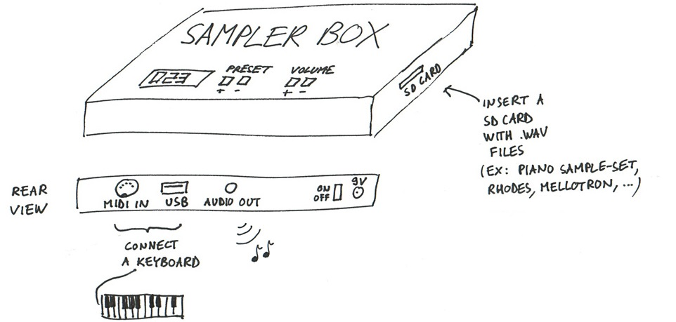

<iframe width="420" height="315"
src="https://www.youtube.com/embed/yz7GZ8YOjTw">
</iframe> 

## Features

* Drop'n'play sampler: drop .WAV samples on the SD card, and play!
* [Open source](http://github.com/josephernest/SamplerBox) / open hardware
* Raspberry Pi computer inside, [download](http://www.samplerbox.org/makeitsoftware)
  the ready-to-use ISO image!
* Cheap: < 99€ to build
* Boot time: 8 seconds
* Polyphony: more than 128 voices
* Low latency
* Memory: can load sample-sets up to 1 GB

Look at the [blog](http://www.samplerbox.org/blog) to see the latest prototypes!
Here is what this project is about:

Playing piano with SamplerBox:

<iframe width="420" height="315"
src="https://www.youtube.com/embed/CDJ87UMOsE8">
</iframe> 
